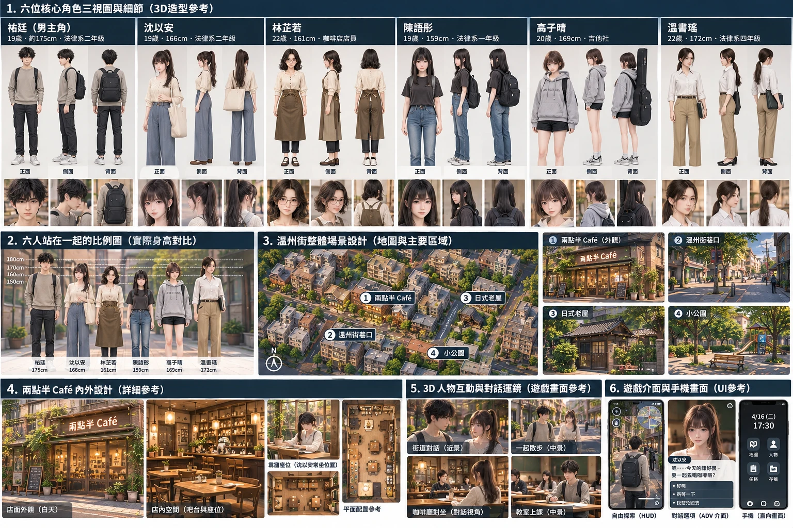
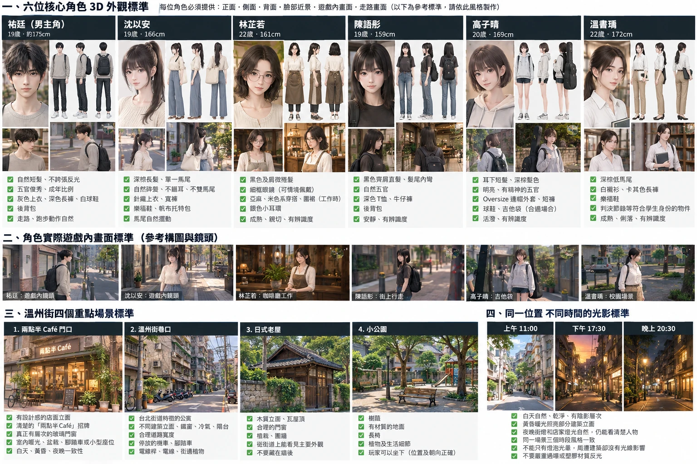
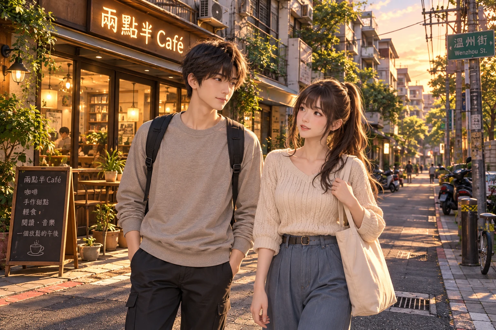

# 《法條之外：台灣法律人生》3D 美術規範（ART DIRECTION）

本文件是 3D 美術重建（v9 起）所有人物、場景、光影與鏡頭的**共同驗收標準**。
參考圖在 `docs/art-rebuild/references/`（使用者 2026-10-09 提供）；實際遊戲截圖與逐項比較在 `docs/art-rebuild/VISUAL_REVIEW.md`；工作進度在 `docs/ART_REBUILD_PROGRESS.md`。

## 0. 優先順序（衝突時以前面的為準）

1. **Character Bible 的正式資料**（`src/data/characters.js`；`CLAUDE.md` 規則 9）：名字、年齡、科系、年級、身高、星座、個性、髮型與服裝識別。
2. 使用者的文字指示（`docs/history/specs/`、`docs/PROJECT_DECISIONS.md`）。
3. 本規範。
4. 參考圖（視覺目標：臉、比例、材質、光影、構圖的品質與方向）。

參考圖是生成圖，有些文字與正式設定不一致。**一律以正式設定為準，不改劇情資料**：

| 參考圖上的文字 | 正式設定（以此為準） |
|---|---|
| 祐廷「法律系二年級」（04） | 法律系一年級、19 歲、175 cm |
| 沈以安「法律系二年級」（04） | 法律系一年級、19 歲、166 cm |
| 林芷若「22 歲・法律系三年級」（05）、「22 歲・咖啡店店員」（04）、「咖啡廳打工生」（03） | 20 歲、外文系二年級、161 cm；在兩點半 Café 打工 |
| 陳語彤「法律系一年級」（05）、「大學法律系學生」（03） | 19 歲、**社會系一年級**、159 cm |
| 高子晴「大學音樂系學生」（03）、「吉他社」 | 20 歲、**資工系二年級**、169 cm；參加吉他社、背吉他袋 |
| 溫書瑀「22 歲・法律系四年級」（04、05） | 21 歲、法律系三年級、172 cm |
| 06 圖林芷若「22 歲」、溫書瑀「22 歲」 | 同上（20 歲、21 歲） |

參考圖裡的英文標語（托特包「Better People Brighter Law」、子晴連帽外套「MOMENT」「COULEUR APRÈS」）只是示意，不是規定。遊戲內招牌與文字一律用正確的繁體中文。

## 1. 參考圖清單

| 檔案 | 內容 | 主要用來驗收 |
|---|---|---|
|  `01_shen_yian_character_sheet.webp` | 沈以安設定表：正側背、臉部近景、遊戲內、細節（髮、項鍊、針織、褲、鞋、包、馬尾）、配色 | 沈以安 3D 模型 |
|  `02_yuting_character_sheet.webp` | 祐廷設定表：正側背、臉部近景、頭部角度、表情、上衣／背包／鞋／材質 | 祐廷 3D 模型（玩家） |
|  `03_six_characters_lineup.webp` | 六人身高與風格對照 | 身高差、比例、整體風格一致性 |
|  `04_overview_characters_wenzhou_cafe_ui.webp` | 六人三視圖、身高對比、溫州街鳥瞰、四個地點、Café 內外、運鏡、UI | Café 內外、運鏡、手機 UI |
|  `05_four_heroines_wenzhou_lighting_ui.webp` | 林芷若、陳語彤、高子晴、溫書瑀個別造型與表情；溫州街鳥瞰；四個地點；Café 內部；**同一地點 11:00／17:30／20:30**；UI | 四位女角、四個地點、三時段光影 |
|  `06_six_characters_standard_sheet.webp` | 六人外觀標準（第一版）、遊戲內鏡頭、四個地點、三時段 | 同上（較早的一版） |
|  `07_yuting_shen_cafe_dusk_target.webp` | 祐廷與沈以安黃昏站在兩點半 Café 外 | **整合場景**（人物×街道×Café×黃昏） |

**不得**把參考圖當遊戲背景、貼圖或合成進截圖；驗收截圖必須是實際執行 Three.js 遊戲的畫面。

## 2. 整體美術風格

- **Premium Stylized 3D Life Simulation**：精緻、自然、略帶日系的 3D 生活模擬。目標感受是「日本生活模擬遊戲的舒服氣氛」＋「台北溫州街的真實生活感」。
- 不是 Q 版、不是 low-poly 風格化、不是純 2D 視覺小說、也不追求電影級寫實。
- 人物：日系動畫風但成熟自然（大學生，不是高中生），臉與眼睛比例接近參考圖的半寫實動畫臉；**禁止** Q 版、chibi、高中制服感、巨大眼睛、貓耳雙馬尾之類的萌系造型。
- 場景：保留台北的辨識度（老公寓、鐵窗、冷氣、雨遮、機車、電線桿、繁中招牌、騎樓）；用比例、植物、光影與生活細節做出氣氛。**不要**把台北變成京都，**不要**亂貼日文招牌。
- 色調：暖米色、木色、淺灰、植物綠為主；黃昏偏橘金；夜晚以店家與路燈的暖光為主，不全黑。

## 3. 3D 人物通用標準

| 項目 | 標準 |
|---|---|
| 比例 | 7～8 頭身；頭不可過大；肩寬、腰臀、腿長符合成年人；男女身高差依正式身高（祐廷 175 > 沈以安 166） |
| 臉 | 半寫實的日系動畫臉；下巴與臉頰線條清楚；鼻子、嘴有形狀但不寫實 |
| 眼睛 | 自然大小（參考圖約為臉寬的 1/5 左右，不是 1/3）；有上眼線與雙眼皮線；虹膜深棕／黑；不閃亮巨大高光 |
| 頭髮 | 一片片有層次的髮束（不是一整塊頭盔）；髮色接近黑或深棕；**不要塑膠高光**（無白色反光帶）；瀏海與側邊碎髮自然落下；馬尾要能隨走路擺動 |
| 服裝 | 輪廓正確（寬褲就是寬褲、針織就有針織紋理、襯衫有領子）；不得殘留原模型的制服背心、領結、百褶裙、手套、奇幻配件 |
| 材質 | 布料霧面；皮膚溫暖不慘白；鞋子有材質區分（皮革樂福鞋／帆布球鞋）；不得整體發亮或像塑膠 |
| 配件 | 依 Character Bible：背包、托特包、眼鏡、耳環、圍裙、吉他袋、判決節錄等；配件跟著骨架動 |
| 陰影 | 主要人物投射即時陰影到地面；路人可用圓形陰影 |
| 動作 | 走路腳步與移動速度一致（不滑步）；站姿自然；坐下時屁股在椅子上、面向桌子；交談時面向對方 |

**禁止**：把同一個女性路人模型換色就當成不同女主角的正式造型；用 CSS／SVG／Canvas／three.js primitive 畫正式人物。

## 4. 六位核心人物外觀標準

（「目前遊戲資產」與「狀態」會隨進度更新；詳細比較與截圖見 VISUAL_REVIEW.md。）

| 人物 | 正式設定 | 髮型／髮色 | 上身 | 下身 | 鞋 | 配件 | 參考圖 | 目前遊戲資產 |
|---|---|---|---|---|---|---|---|---|
| 祐廷（玩家） | 19、175 cm、法律一 | 自然蓬鬆的短髮、有瀏海與層次、黑／深棕、無塑膠反光 | 淺灰（燕麥灰）圓領長袖棉 T／衛衣，袖口下擺羅紋 | 深灰直筒長褲（略寬） | 白色球鞋 | 黑色後背包 | 02、03、07 | `assets/models/char/vroid_yuting.vrm`（`char.yuting`） |
| 沈以安（小安） | 19、166 cm、法律一 | 深棕長髮**單一高馬尾**、額前與側邊碎髮 | 米白 V 領針織衫（寬鬆、粗針紋理） | 藍灰色高腰**寬褲**（打褶、垂墜） | 深棕樂福鞋 | 米色帆布托特包、簡單手錶、細項鍊 | 01、03、07 | `vroid_heroine_01.vrm`（`char.heroine_01`） |
| 林芷若 | 20、161 cm、外文二 | 黑色**及肩微捲**髮 | 米色亞麻襯衫（捲袖） | 淺色長褲／寬褲；在 Café 打工時加**咖啡色圍裙** | 深色鞋 | **細框眼鏡**（看書時）、**銀色小耳環** | 03、05 | `vroid_heroine_02.vrm`（新建，尚未接入遊戲） |
| 陳語彤 | 19、159 cm、社會一 | 黑色**齊肩直髮、髮尾內彎**、齊瀏海 | 深色（炭灰）T 恤 | 牛仔褲 | 球鞋 | 黑色後背包、手腕髮圈 | 03、05 | `vroid_heroine_03.vrm`（`char.heroine_03`） |
| 高子晴 | 20、169 cm、資工二 | 深棕**耳下短髮**、瀏海隨便撥 | 淺灰 **oversize 連帽外套** | 短褲 | 球鞋（＋白襪） | **吉他袋** | 03、05 | `vroid_heroine_04.vrm`（新建，尚未接入遊戲） |
| 溫書瑀（溫學姊） | 21、172 cm、法律三 | 深棕**低馬尾** | **白襯衫**（有領、捲袖） | **卡其長褲**、皮帶 | 樂福鞋 | 判決節錄（資料夾／書） | 03、05 | `vroid_heroine_05.vrm`（新建，尚未接入遊戲） |

## 5. 溫州街：建築與街道標準

- **巷寬**：主巷 7 m 柏油＋兩側排水溝與停車帶（總寬約 10 m）；小巷 5 m。
- **建築**：3～6 層台北老公寓；一樓店面或住家大門、二樓以上有窗、**鐵窗**、**陽台**（盆栽、晾衣）、**雨遮**、**冷氣室外機**、水塔、頂樓加蓋；外牆有磁磚、馬賽克、洗石子、油漆等不同材質；相鄰建築立面不同。
- **街道生活**：電線桿＋電線、反光鏡、路燈、機車（成排停放，角度略有不同）、腳踏車、盆栽、行道樹、垃圾桶、招牌（直立式＋橫式，繁體中文）、紅線／黃線、排水溝蓋、人孔蓋。
- **植物**：行道樹與老樹有自然樹形與樹蔭；牆邊盆栽；日式老屋的庭院樹比屋頂高。
- **不要**：一整排一樣的方盒、純色無材質的牆、亂放的日文招牌、為了熱鬧而塞滿道具擋路。
- 所有可見的建築與大型道具必須同步 **NavGrid**（`blockRect/blockCircle`）與**鏡頭碰撞盒**，改完跑 `tests/p0_movement.py`。

## 6. 四個重點地點

| 地點 | 必須有 | 參考圖 |
|---|---|---|
| 兩點半 Café 門口 | 有設計感、可辨識的店面；正確的繁中招牌「兩點半 Café」；木框＋大玻璃＋金屬（燈具、門把、招牌支架）的材質層次；**窗內看得到店內空間**（桌椅、吊燈、書架）；入口盆栽、A 字立牌、腳踏車或小座位；白天自然採光、黃昏與夜晚窗內暖光；門窗位置和店內空間一致 | 04-①、05-8①、06-三.1、07 |
| 溫州街巷口 | 台北老公寓的真實比例與不同立面；窗、陽台、鐵窗、雨遮、冷氣；自然分布的機車、腳踏車、植物；電線桿、電線、生活痕跡；合理巷寬；舒服的透視與光影 | 04-②、05-8②、06-三.2 |
| 日式老屋 | 木構（雨淋板、格子窗、木門）、黑瓦屋頂、石牆或圍牆＋植栽、可辨識的入口；**從一般街道視角就看得到主要外觀**（不能被圍牆整個擋住） | 04-③、05-8③、06-三.3 |
| 小公園 | 真實的樹與樹蔭、長椅、有材質的地面（鋪面＋草地）、植物、自然的休憩空間；玩家可以走動、坐下（位置與朝向正確）、互動 | 04-④、05-8④、06-三.4 |

## 7. 兩點半 Café 內外設計

- **外觀**：深木色門窗框、大面玻璃（可看到店內暖光、吊燈、書架、桌椅、植物）、門楣上方的招牌（深色底＋米白字「兩點半 Café」，夜間字發光）、壁燈、門口盆栽與爬藤、A 字黑板立牌（繁中：手沖、甜點、讀書位）。
- **內部**：吧檯（咖啡機、磨豆機、杯具）、木書架、窗邊座位（沈以安常坐的位置）、吊燈（暖色）、木地板、植物；林芷若在吧檯工作時穿圍裙。
- **一致性**：外面看到的窗、門位置要和室內空間對得上（室內窗邊座位要在外觀的大窗後面）。

## 8. 光影規範（同一地點三個時段）

| 時段 | 標準 | 不可以 |
|---|---|---|
| 上午 11:00 | 白天自然、乾淨；太陽偏高，陰影清楚但不死黑；天空淡藍 | 過曝、整個畫面發白 |
| 下午 17:30 | 黃昏：太陽低、橘金色，照在建築立面的一側；長影子；天空由暖橘到淡紫藍；店內燈開始亮 | 只是整體染橘色；只有招牌亮 |
| 晚上 20:30 | 夜晚：路燈與店家的暖光照亮周圍地面與牆（有光池）；窗內暖光；天空深藍不全黑；**人物仍看得清楚** | 只有發光的燈泡但周圍沒被照亮；人物變成黑影 |

通用：同一場景三個時段的風格一致；材質不要塑膠反光；人物在三個時段都要有可辨識的臉。

## 9. 遊戲內鏡頭構圖標準

| 鏡頭 | 標準 | 用在 |
|---|---|---|
| 探索（跟隨） | 第三人稱、在玩家後上方，距離約 4.5～5.5 m、俯角約 12～20°；玩家在畫面中下方 1/3，前方街道可見；直向（390×844）與橫向（844×390）都要看得到前方路線 | 一般移動（04-6 探索畫面） |
| 一起散步（中景） | 兩人全身＋周圍街景，鏡頭在兩人斜前方、高度約胸口 | 同行劇情（04-5） |
| 街道對話（近景） | 過肩或雙人半身，鏡頭高度接近眼睛，看得到表情與背景店面 | 3D 對話運鏡（04-5、07） |
| 室內 | 距離較近（約 4 m），避免鏡頭穿牆；牆會淡出 | Café、教室、宿舍 |

驗收截圖一律用**一般玩家鏡頭**（必要時再加演出鏡頭），不能只拍俯視圖。

## 10. 參考圖 ↔ 遊戲資產對應

| 參考 | 遊戲裡對應的東西 | 程式／檔案 |
|---|---|---|
| 01 沈以安 | `heroine_01`（舊 id `an`） | `tools/vroid_build.py` 的 `build_heroine_01` → `assets/models/char/vroid_heroine_01.vrm`；配件 `src/props3d.js`；2D 立繪 `assets/portraits/heroine_01/` |
| 02 祐廷 | 玩家 | `build_yuting` → `vroid_yuting.vrm`；`src/game3d.js` 的 heroSpec |
| 03 六人對照 | 六個 VRM 的身高 | `CHARACTERS[*].char3d.height`、`ASSETS.manifest` 的 height |
| 05／06 林芷若 | `heroine_02` | `build_heroine_02` → `vroid_heroine_02.vrm` |
| 05／06 陳語彤 | `heroine_03` | `build_heroine_03` → `vroid_heroine_03.vrm` |
| 05／06 高子晴 | `heroine_04` | `build_heroine_04` → `vroid_heroine_04.vrm` |
| 05／06 溫書瑀 | `heroine_05`（舊 id `sis`） | `build_heroine_05` → `vroid_heroine_05.vrm` |
| 04／05／06 兩點半 Café 外觀 | 溫州街的 Café 建築 | `src/zones3d.js`（`buildWenzhou`）、`src/townkit3d.js`（`TK.apartment` 的 cafe 店面） |
| 04／05 Café 內部 | `cafe` 區域 | `src/zones3d.js`（`const cafe`） |
| 04／05／06 巷口 | 溫州街主巷與巷口 | `buildWenzhou` |
| 04／05／06 日式老屋 | 日式宿舍 | `TK.japaneseHouse`、`buildWenzhou` |
| 04／05／06 小公園 | 溫州街小公園 | `buildWenzhou`（小公園段） |
| 05-10／06-四 三時段 | 日夜系統 | `src/engine3d.js`（`KEY`、`applyTime`）、區域的 `applyTimeOutdoor`、`TK.setNight` |
| 07 雙人黃昏 | 同行（`flags.companion='an'`）時的溫州街 | `src/story3d.js`（`spawnCompanion`）；拍攝腳本 `tools/shots/scene_shot.py` |
| 04-6／05-11 UI | 手機 HUD、ADV 對話 | `index.html`、`src/game3d.js`、`src/adv3d.js`（本輪不改 UI） |

## 11. 素材與授權

- 3D 人物目前以 **VRoid Studio 官方 CC0 樣本**改作（`tools/vroid_build.py`，來源見 `LICENSES.md`）。**樣本的臉、髮型與服裝數量有限**：男性只有 2 張臉，可用的女性臉約 6 張，衣服只有樣本上有的款式。達不到參考圖的部分會在 VISUAL_REVIEW.md 標 `BLOCKED_BY_ART_ASSET` 並寫明需要什麼（例如：用 VRoid Studio 依設定表製作的六人 VRM、或授權明確可再散布的服裝／髮型素材）。
- 不購買素材、不使用授權不明的模型；新增素材一律記在 `LICENSES.md`。
