# 人物外觀驗收（CHARACTER REVIEW）

六位主要人物「參考圖 ↔ 實際遊戲畫面」的逐人比對與修改紀錄。建築與場景的驗收在 `VISUAL_REVIEW.md`（另一個工作階段負責），人物的在這裡。
規範：`ART_DIRECTION.md` 第 3、4、12.5 節；參考圖 `references/01`～`07`（下面並排用的是 `06` 的那一欄）。
截圖工具：`tools/shots/char_review.py`（實際執行遊戲；溫州街小公園前、白天 11:00；Playwright＋SwiftShader，**不是手機實機**）。
狀態：全部**未經使用者驗收**；在使用者親自確認前不得標 `ART_APPROVED`。

---

## 0. 2026-10-10 使用者回報「人物又變得非常醜」——先查清是什麼

| 項目 | 結果 |
|---|---|
| 使用者玩的版本 | 線上 GitHub Pages（當時 `main`＝v9.3 第 24 批 `0ef3a73`） |
| 用同一版限速重現（快取關閉＝第一次開遊戲） | 8 Mbps：6 個人物資產逾時（動畫、溫書瑀、四個路人底模），畫面上 19 個 NPC **全部是程序化備用人物**；4 Mbps：12 個全部逾時，**主角也是程序化備用人物**（`GM.heroDriver: proc`、`CHAR.failures: char.yuting: not loaded`） |
| `ASSETS.errors` | 空的——VRM 檔案沒有壞 |
| 60 秒後（模型都下載完了） | 主角、NPC **仍然是程序化備用人物**：主角只在開機時建一次、NPC 只在進區域時建，沒有換回來的機制 |
| 另一種情況 | 女主角自己的模型還沒到、路人底模先到時，會**借用路人的身體再換顏色**（看起來「完全不像本人」） |
| 修正 | `356368b`：人物模型分三批依序下載（動畫＋主角 → 主要角色 → 路人），主要人物到齊才進標題（顯示已下載 MB）；晚到的模型由 `GAME.upgradeModels` 原地換上。`tests/model_upgrade.py` 在 v9.3 失敗 3 項、修正版通過 |
| 修正後同樣 4 Mbps | 主角與 19 個 NPC 全部是 VRM、沒有逾時；第一次載入約 87 秒（代價） |
| 還沒上線 | 修正在開發分支；使用者決定發布時，兩個開發分支先合併、跑發布前測試 |

**結論**：使用者看到的「非常醜」很可能是程序化備用人物（截圖 `screenshots/` 沒有收；重現截圖在工作階段暫存）。但就算正確載入 VRM，**和參考圖仍然差很多**（下一節）。

---

## 1. 改前（2026-10-10，開發分支 `48e7df9`，全部確認是 VRM、不是備用人物）

六人臉部特寫（左到右：祐廷、沈以安、林芷若、陳語彤、高子晴、溫書瑀）：

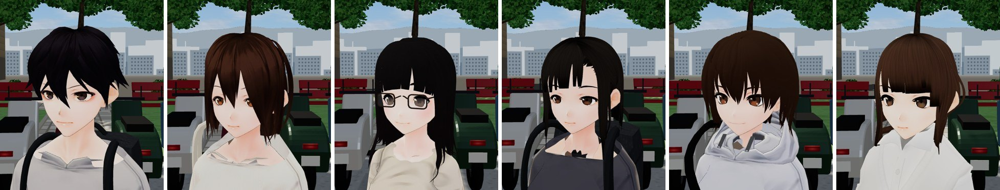

六人正面全身：

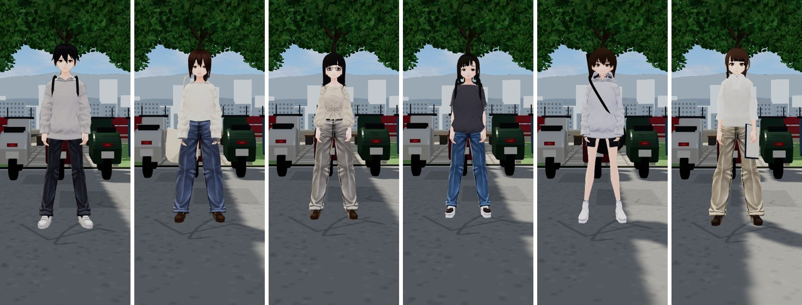

逐人（參考圖｜正面｜45 度｜側面｜背面｜臉部特寫｜走路｜實際遊戲畫面）：

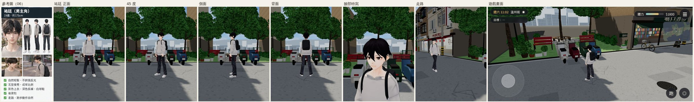
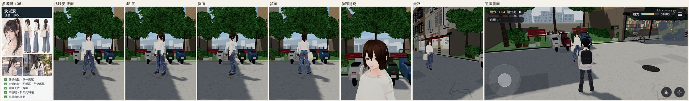
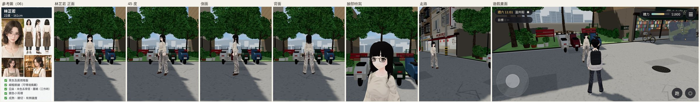
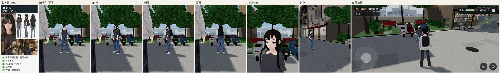
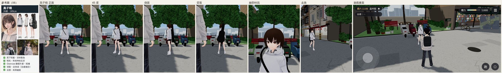
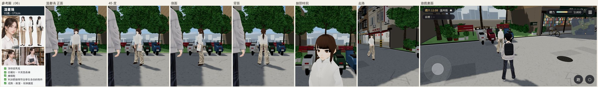

（林芷若之後四張的左邊那條灰色手臂是主角站在鏡頭旁——截圖工具這一輪沒把主角移開，不是人物模型的問題。）

### 1.1 六個人共同的問題（差最多的地方）

| # | 參考圖 | 遊戲 | 原因 |
|---|---|---|---|
| C1 | 溫暖的膚色、柔和的立體陰影（臉頰、鼻樑、下巴下面都有陰影） | 皮膚接近慘白、臉幾乎沒有明暗，像一張平面貼紙 | VRoid 的 MToon 卡通著色（受光面整片同一個亮度）＋皮膚貼圖偏白 |
| C2 | 眼睛自然大小、深棕／黑虹膜、沒有大塊高光 | 眼睛仍偏大、有動畫高光、上眼線很粗 | VRoid 動畫臉；之前只縮小了約 10% |
| C3 | 五官各有特徵（臉型、眉形、眼型都不同） | **五位女主角幾乎同一張臉**，只靠髮型區分 | 都是 VRoid 樣本的臉，沒有個別改臉型 |
| C4 | 細緻的髮絲 | 一大片一大片的髮束＋黑色描邊 | VRoid 髮型網格＋MToon 描邊 |
| C5 | 衣服有布料的明暗與皺褶 | 淺色衣服接近一片白（米白、淺灰、白襯衫分不出來） | 同 C1 |

### 1.2 逐人

| 人物 | 參考圖（06、01、02、03、05） | 目前遊戲仍不符合的細節 |
|---|---|---|
| 祐廷 | 自然蓬鬆短髮、瀏海在眉毛上；燕麥灰圓領毛衣；深色長褲；白球鞋；後背包 | ①頭髮是尖刺狀的動畫髮型、幾束長瀏海**橫過臉和眼睛**；②上衣看起來是近白色、袖子很肥的連帽衫改的，不是合身的燕麥灰圓領毛衣；③臉 C1–C2；長褲、球鞋、後背包大致符合 |
| 沈以安 | 深棕長髮**高馬尾**、額前碎髮＋臉旁長碎髮；米白寬鬆 V 領針織；藍灰寬褲；樂福鞋；帆布托特包 | ①**正面看是一頭短鮑伯**——馬尾從正面完全看不到，臉旁的頭髮是一整片，不是碎髮；②針織衫是圓領、偏白，不是 V 領米白；③寬褲看起來像捲褲管的牛仔褲（藍、有褲管反摺）；④臉 C1–C3；樂福鞋、托特包符合 |
| 林芷若 | 黑色**及肩微捲髮**、側分、沒有厚瀏海；細框眼鏡；銀色小耳環；米色亞麻上衣；（工作時）咖啡色圍裙 | ①頭髮是**黑長直＋齊瀏海**（參考圖是及肩微捲、側分）——辨識度差最多；②臉 C1–C3；眼鏡有、米色上衣與淺色長褲大致符合；耳環在這個距離看不到 |
| 陳語彤 | 黑色**齊肩直髮、髮尾內彎**、齊瀏海；深色 T 恤；牛仔褲；後背包 | ①頭髮比齊肩長很多，臉兩側各一長束垂到胸口（像雙馬尾的殘留）；②領口中間的黑色小蝴蝶結（已知 #34）；③臉 C1–C3；T 恤、牛仔褲、球鞋、後背包符合 |
| 高子晴 | 深棕**耳下短髮**、瀏海隨意撥；淺灰 oversize 連帽外套；短褲；球鞋＋白襪；吉他袋 | 外觀元素最接近參考圖。①臉 C1–C3；②連帽外套偏白、帽子的形狀看起來硬；③腿很細長（短褲下面整條腿）、站姿僵 |
| 溫書瑀 | 深棕**低馬尾**、**側分**、沒有齊瀏海；白襯衫（有領、捲袖）；卡其長褲；樂福鞋；判決節錄資料夾 | ①**齊瀏海**（參考圖是側分、成熟）——看起來比參考圖年輕很多；②白襯衫看起來像一件寬大的白外套，看不出領子和捲袖；③臉 C1–C3；卡其褲、樂福鞋、資料夾符合 |

---

## 2. 修改計畫（依「玩家最先看到、差最多」排序）

工具：遊戲端材質（`src/character3d.js` 的 VRM 材質設定）＋模型改作（`tools/vroid_build.py`：直接改 VRM 的網格、貼圖、骨架；必要時用 Blender bpy 處理網格）。不是只換色或加配件。

1. **皮膚與明暗（C1、C5，六人＋路人共用）**：皮膚改成溫暖膚色、明暗改成柔和漸層（MToon 的 toony／shift／陰影色）、臉部描邊變細，衣服受光面不再曝成白色。
2. **臉（C2、C3）**：眼睛再縮小、拿掉動畫高光、眉形與眼型每個人不同；臉型（下巴、臉長）每個人微調；嘴唇、臉頰、鼻樑的柔和陰影畫進臉部貼圖。
3. **頭髮（C4 與各人髮型）**：祐廷瀏海縮短不擋眼睛；沈以安正面看得到高馬尾與臉旁長碎髮；林芷若改成及肩微捲側分；陳語彤剪到齊肩、拿掉胸前長束；溫書瑀拿掉齊瀏海改側分。
4. **服裝輪廓**：祐廷合身燕麥灰圓領毛衣；沈以安 V 領米白針織、褲子不像牛仔褲；溫書瑀襯衫領子與捲袖。

**誠實說明**：VRoid 樣本是動畫風格的基底，參考圖是半寫實繪風。上面的修改會讓畫面明顯接近參考圖，但不會變成參考圖那種寫實程度；要更接近需要換成半寫實的人物基底（例如 MakeHuman／MPFB 的 CC0 素材），那是改變美術方向的決定，要使用者決定。

---

## 3. 第一步：皮膚溫度與柔和明暗（六人＋路人共用，`src/character3d.js` 的 `C.LOOK`）

原因（遊戲裡讀出的材質參數）：VRoid 的皮膚陰影色是 `#f8d0dc`，幾乎和受光面一樣白 → 臉沒有明暗；皮膚貼圖偏白。
同一個鏡頭比較四組（上到下：A 現狀、B 暖膚＋柔和陰影、C 更暖更柔、D 偏方向光；每列：全身｜沈以安｜祐廷）：

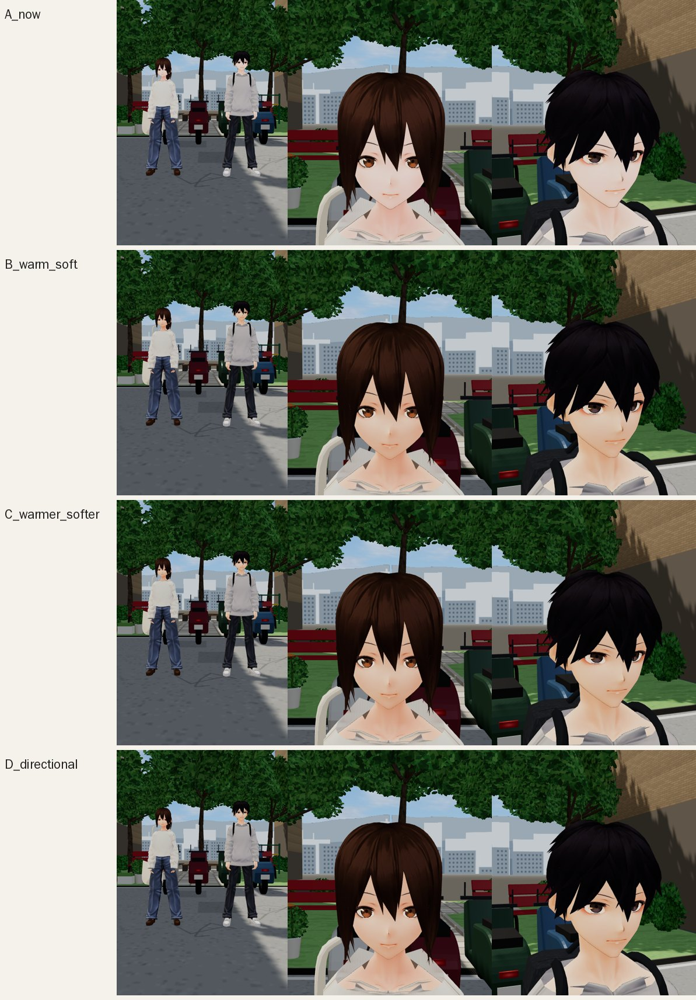

黃昏 17:30（A 現狀、C、E＝C＋拿掉眼睛的動畫高光）：

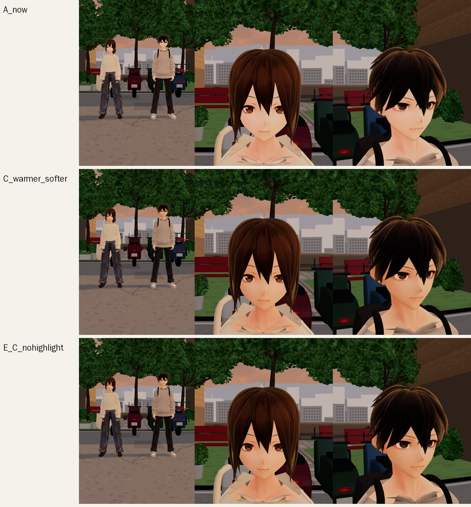

選 **E**：皮膚乘暖色 `#ffeee2`、陰影色 `#cf967f`、toony 0.15、shift 0.05、GI 0.7；頭髮陰影 ×0.62；衣服陰影 ×0.74；描邊寬度 ×0.5；不畫 EyeHighlight／EyeExtra。
**這一步只解決「慘白、沒有明暗」，臉型、眼睛、髮型、衣服輪廓還沒改**（下一步改模型本身）。狀態：技術完成；美術待使用者驗收。

---

## 4. 祐廷 第一輪（模型本身：`tools/vroid_build.py` 的 `build_yuting`）

實際遊戲畫面（溫州街 11:00；上排改前、下排改後；左邊是參考圖 06）：

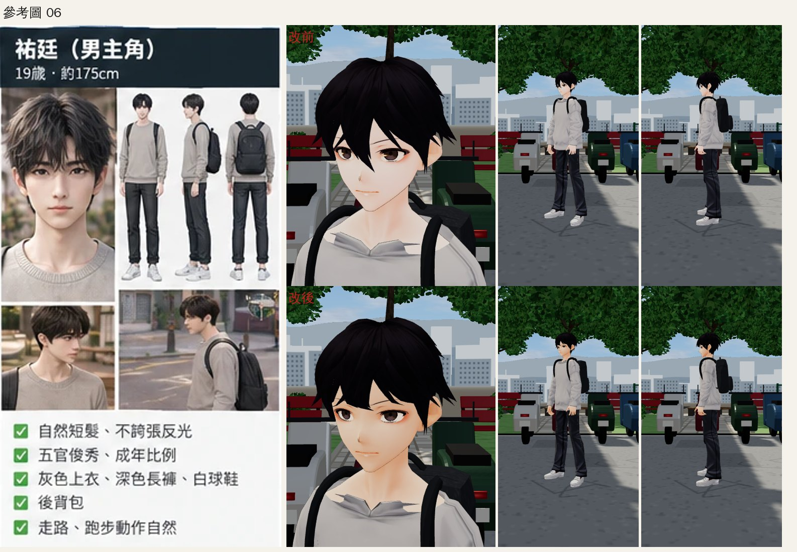

| 修改 | 做法（新函式） | 玩家看到的差別 |
|---|---|---|
| 瀏海到眉毛 | `trim_bangs`：臉前方、眉毛以下的頭髮在垂直方向壓短（髮尾的尖細形狀、寬度、骨頭權重不變） | 原本一束束垂到鼻子、蓋住眼睛 → 眼睛露出來 |
| 眼睛再縮小 | `scale_eyes` 0.93／0.9 → 0.86／0.82 | 偏細長、比較不像大眼動畫臉 |
| 鼻樑 | `nose_bridge`：鼻子那一條臉皮往前推 7 mm（中線最多、往兩側與上下漸減） | 側面、45 度看得出鼻子 |
| 上衣收合身 | `fit_to_body`：上衣每個頂點朝最近的身體表面靠近（距離 d → 1.4 cm＋(d−1.4 cm)×0.45） | 寬鬆連帽衫稍微收窄（近看明顯、遠看不明顯） |
| 領口 | `crew_collar`：領口那圈往脖子收、壓低 | 兩片翻領變平；**中間的 V 形缺口和兩端的小尖角還在**（待修） |

測試：`stairs_feet_unit`（上下樓梯腳步）PASS、`sim_hair char.yuting`（走路、瞬移時頭髮）PASS；遊戲內截圖沒有 JS 錯誤。都是 Node／Playwright 模擬，不是手機實機。
仍不符合參考圖：臉仍是動畫臉（眼線粗、虹膜大）；頭髮仍是一片片的髮束；上衣是連帽衫改的、不是毛衣（沒有針織紋與羅紋）；領口 V 形缺口。狀態：美術待使用者驗收。

---

## 5. 沈以安 第一輪（`tools/vroid_build.py` 的 `build_heroine_01`；分析代理在暫存區做的原型整合進來）

實際遊戲畫面（溫州街 11:00；上排改前、下排改後：臉部特寫｜正面｜45 度｜側面｜背面；左邊參考圖 06）：

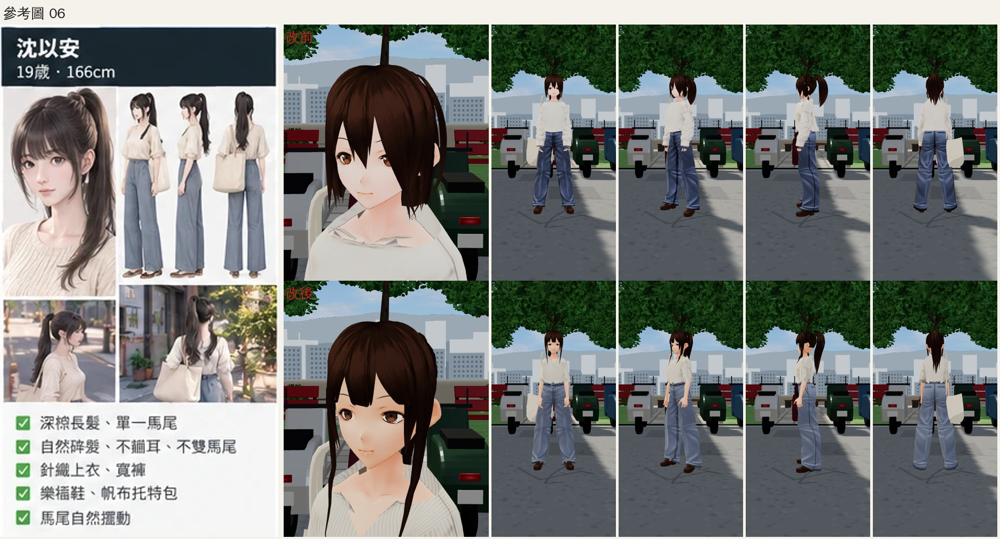

| 修改 | 做法 | 玩家看到的差別 |
|---|---|---|
| 瀏海剪到眉毛 | `edit_strands`＋`trim_fn`（瀏海 10 束，原本 4 束橫過眼睛） | 齊眉瀏海、眼睛完全露出 |
| 側簾、後頸收短 | `edit_strands`＋`trim_fn` | 耳朵露出、正面不再像短鮑伯 |
| 臉旁兩束長碎髮 | `drape_fn`：拉長到胸口、整條推到衣服前面 1.2 cm | 參考圖最明顯的特徵（碎髮垂過臉頰到胸前） |
| 馬尾 | `reshape_ponytail`：貼著背垂到腰上方、往下漸細；塑形之後才加彈簧骨 | 原本離背 10–12 cm 往後翹、只到肩膀下；現在正面、側面都看得到高馬尾 |
| 上衣 | `v_neck`、`cut_sleeves`＋`extend_sleeves`、`fit_to_body`、`cut_below`、粗針直紋（12 px）、米色 | V 領、袖子到手肘有反摺、下擺紮進褲子 |
| 褲子 | `raise_waist`（褲頭到自然腰線）、`straighten_hem`（褲管直直垂到鞋面）、霧面淺藍灰 | 高腰寬褲；原本褲口外翻像反摺的牛仔褲 |
| 臉 | `scale_eyes` 0.82／0.78、`face_slim`（下半臉收窄＋下巴稍長）、`nose_bridge` | 眼睛較小、鵝蛋臉 |

測試：`sim_hair char.heroine_01`（走路、瞬移時馬尾）PASS；`stairs_feet_unit char.heroine_01`（上下樓梯腳步，新的褲管垂到鞋面）PASS；遊戲內截圖沒有 JS 錯誤。Node／Playwright 模擬，不是手機實機。
仍不符合參考圖：針織直紋太規則、像條紋襯衫；褲子貼圖仍有腰帶環與牛仔布的明暗；臉仍是動畫臉（眼線粗、虹膜大）；髮束仍是一片片的大髮片（細髮絲需要新的髮型網格）；頭身比約 6.6（參考圖約 8，規範 7～8；縮頭要六個人一起做，下一步）；手錶、細項鍊還沒有。狀態：美術待使用者驗收。

---

## 6. 林芷若 第一輪（`tools/vroid_build.py` 的 `build_heroine_02`；眼鏡在 `src/props3d.js`）

實際遊戲畫面（溫州街 11:00；上排改前、下排改後：正面｜45 度｜側面｜背面｜臉部特寫｜走路｜遊戲畫面；左邊參考圖 06）：

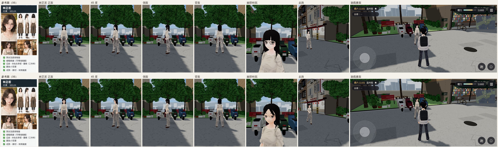

瀏海撥法的 4 種變體（look-dev 檢視頁，不是遊戲畫面；選 C）：第一版的髮尾往上收，尖細的髮尾在額頭排成一排鋸齒；D 往另一邊撥會蓋住眼睛。

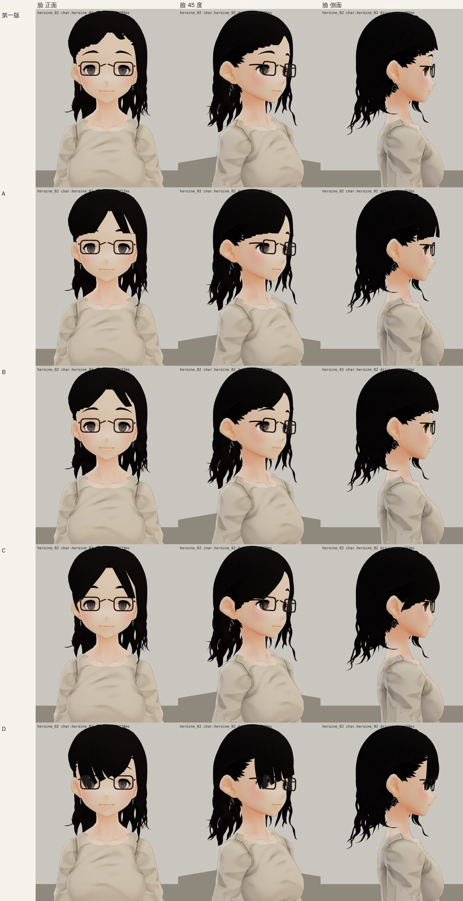

look-dev 全身比較（上排現在的遊戲版、下排這一輪；兩排都已經是新眼鏡）：

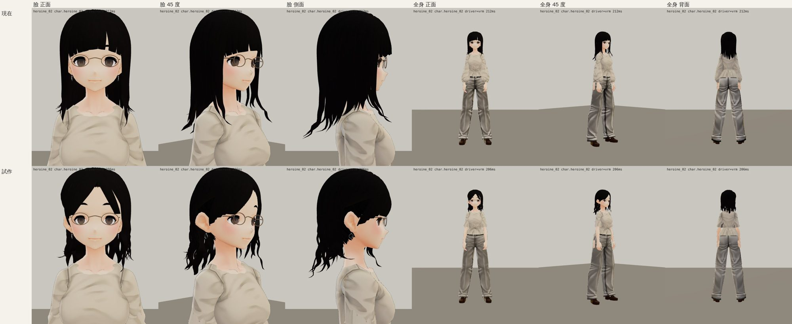

| 修改 | 做法（新函式） | 玩家看到的差別 |
|---|---|---|
| 瀏海側分 | `sweep_bangs`：每一束以「頭中心→髮根」為軸彎向兩側，髮尾拉長到眼鏡外側（分線在左邊 15°） | 原本厚齊瀏海壓在眼鏡上 → 左分、往兩側撥開，露出額頭與眉毛 |
| 剪到及肩 | `shorten_hair_rig`：肩上以下的頭髮等比縮短，**髮束的彈簧骨一起移、IBM 重算**（只改頂點的話，彈簧骨一動就把頭髮拉回原本的長度） | 過肩直髮 → 及肩 |
| 右耳露出 | `tuck_behind_ear`：右邊蓋住耳朵的側髮繞頭往後轉到耳後，改綁頭骨 | 耳朵和銀色小耳環看得到（參考圖的識別點） |
| 微捲 | `wave_bob`：耳下的側髮、後髮沿半徑與切線方向做波浪，每一束相位不同，法線跟著調整 | 直髮 → 髮尾微捲 |
| 髮際線 | `paint_hairline`：瀏海撥開後露出的額頭上方，在臉的貼圖上塗髮色（貼圖解析度的平滑曲線；原型刪三角形會留下鋸齒） | 額頭上方不再是一片膚色 |
| 眼鏡 | `props3d.js` 的 `glasses`：橢圓、框寬 1.6 mm、暖灰金屬色（舊版是 2.8 mm 深色圓角方框） | 從黑框眼鏡變成參考圖的細框圓眼鏡 |
| 上衣 | `drop_small_parts` 拿掉腰間蝴蝶結；`cut_sleeves`＋`extend_sleeves` 燈籠長袖 → 手肘上方反摺袖；`fit_to_body` 收下襬 | 不再像荷葉邊襯衫；參考圖的短袖亞麻衫 |
| 褲子 | 貼圖細節保留 0.85 → 0.38 | 緞面反光、縫線變淡（還在，見下面） |
| 臉 | `scale_eyes` 0.9／0.88 → 0.80／0.74、`nose_bridge` 4 mm | 眼睛較小、側面看得出鼻樑 |

測試：`sim_hair char.heroine_02`（走路、瞬移時髮尾）PASS；`stairs_feet_unit char.heroine_02`（上下樓梯腳步）PASS；遊戲內截圖沒有 JS 錯誤、driver＝vrm。Node／Playwright 模擬，不是手機實機。
仍不符合參考圖：分線偏左、參考圖接近中分；額頭露出比參考圖多；右側太陽穴那裡瀏海和側髮交接的地方，側面看有一排尖角；捲度只在髮尾、而且是一片片髮片（參考圖是蓬鬆的大波浪，需要新的髮型網格）；臉仍是動畫臉；頭身比約 6.5；褲子仍有腰帶環與側縫線；咖啡廳圍裙（遊戲內配件）這一輪沒改。狀態：美術待使用者驗收。

---

## 7. 陳語彤 第一輪（`tools/vroid_build.py` 的 `build_heroine_03`；後背包在 `src/props3d.js`、`src/character3d.js` 的 `C.MODEL_PROPS`）

實際遊戲畫面（溫州街 11:00；上排改前、下排改後：正面｜45 度｜側面｜背面｜臉部特寫｜走路｜遊戲畫面；左邊參考圖 06）：

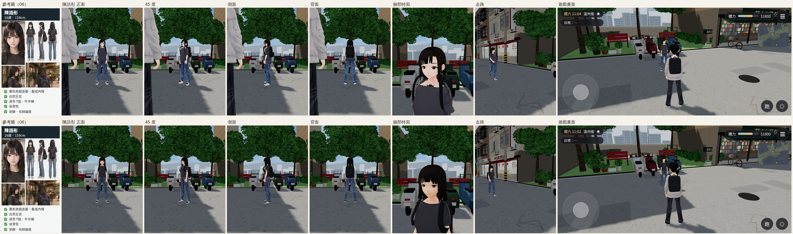

後背包背帶（look-dev 檢視頁，頭髮隱藏；上排舊的圓管、照祐廷身材的路徑；下排這一輪）：

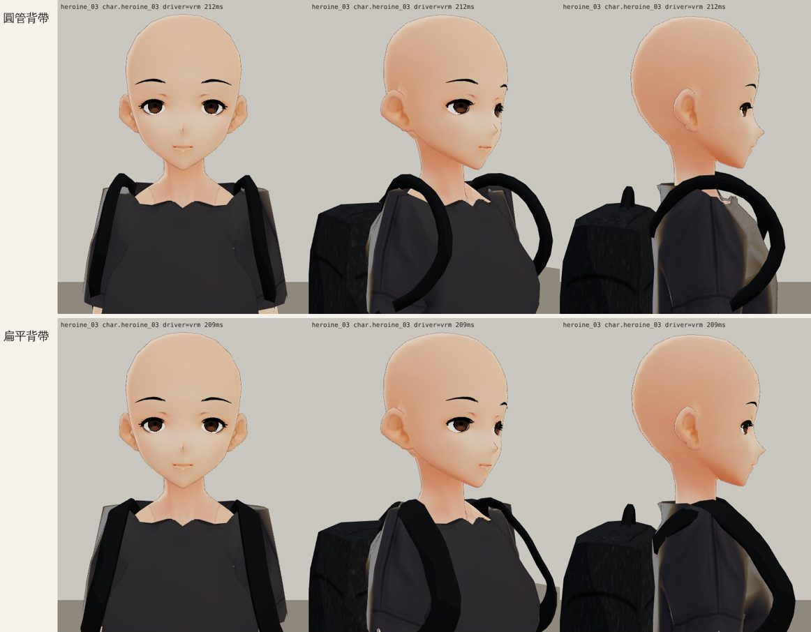

**更正第 1 節的不符清單**：「臉兩側各一長束垂到胸口」不是頭髮，是後背包的背帶——背帶路徑照祐廷的身材設定，套在 159 cm 的陳語彤身上，頂端比她的肩膀高 4 cm（和下巴一樣高），前段直直垂到胸口。「領口正中間的黑色小蝴蝶結」（ART_REBUILD_PROGRESS #34）也找到真正原因：胸口皮膚被 `hide_covered` 刪掉了，從斜上方看進領口就是軀幹裡面。

| 修改 | 做法（新函式） | 玩家看到的差別 |
|---|---|---|
| 左右頭髮對稱 | 拿掉原樣本「夾到耳後」的三束短髮；`mirror_hair_strands`＋`missing_mirror_picker`：右邊有、左邊沒有的 9 束鏡射到左邊（彈簧骨對應到左邊最近的骨頭） | 左耳、左臉頰不再整片露出；兩邊頭髮直直落下蓋住耳朵 |
| 瀏海補齊 | `mirror_hair_strands` 的 offset 模式：中間那束往左複製一份 | 左額頭的三角形空白、中間的楔形分縫補起來，完整齊瀏海 |
| 齊肩 | `hair_length_by_angle`＋`bob_target`：每一束依髮尾方位拉長（後 1.285、側 1.318、前 1.300 m），髮尾的內彎弧整段平移 | 下巴長的前長後短鮑伯 → 齊肩直髮、髮尾內彎 |
| 圓領 | `crew_collar_fit`（往脖子收、順著肩膀斜面往上滑）＋`smooth_neckline`（領口線平滑、下面那一圈布 Taubin 平滑） | 寬一字領 → 貼脖子的圓領；領口不再是鋸齒 |
| 黑色蝴蝶結 | 領口正下方的胸口皮膚留著（`hide_covered` 的 y_keep），深灰內搭塗到更低 | 蝴蝶結消失 |
| T 恤 | 袖子剪到上臂中段、`fit_to_body` 收合身、下擺在臀部；炭灰 `#333338` | oversize 喇叭袖 → 合身短袖 |
| 鞋 | `squash_soles`：鞋底壓薄（原本在腳底下 5 cm） | 不再像厚底鞋；人物也不再被縮小 4% |
| 牛仔褲 | 中藍灰 `#5d6f86`、貼圖細節 0.55 | 不再是發亮的寶藍色 |
| 臉 | `scale_eyes` 0.80／0.76、`face_slim` 0.04（刻意比沈以安圓一點）、`nose_bridge` 5 mm | 眼睛較小、側面看得出鼻樑 |
| 後背包 | `props3d.js` 的 `backpack` 加參數：`drop`（包身往下 7 cm，齊肩的頭髮垂在包上面）、`strap`（照她的肩膀與胸口實際量的路徑）、`flat`（4 cm 寬、8 mm 厚的扁平背帶，寬面貼著身體）。祐廷的背包不變 | 背帶貼在肩上、沿著胸口往腋下走，不再是兩條垂到胸前、像頭髮的黑管 |

測試：`sim_hair char.heroine_03` PASS（最多高 0.006 m）；`stairs_feet_unit char.heroine_03` PASS；遊戲內截圖沒有 JS 錯誤、driver＝vrm。Node／Playwright 模擬，不是手機實機。
仍不符合參考圖：臉仍是動畫臉、眉毛是上挑的細眉（參考圖是直眉，要重畫貼圖）；頭髮是一片片髮片、瀏海太厚太齊；腋下到背包下緣那段背帶離身體 2～3 cm（包身 30 cm 寬，背帶接在包的兩角；走路時要看）；參考圖的棕色皮帶、手腕髮圈還沒有；T 恤是連帽上衣改的（沒有羅紋領口）；頭身比約 6.5。狀態：美術待使用者驗收。

---

## 8. 高子晴 第一輪（VRoid 加工；**遊戲內截圖驗收未做**，2026-10-10 使用者改要求以 Blender 正式製作人物，這一輪先停在這裡）

`build_heroine_04`：瀏海剪到（縮小後的）眼睛上緣（`edit_strands`＋`trim_fn`）；`bob_reshape`：蘑菇頭 → 耳下鮑伯（到下巴維持寬度、髮尾鈍）；新函式 `refit_hair_joints`：頭髮頂點改形狀之後，髮束彈簧骨跟著移、IBM 重算（不移的話兩側髮尾被重力甩成往外翹的翅膀——look-dev 關掉重力對照確認過）；`scale_eyes` 0.8／0.8、`face_slim` 0.05、`nose_bridge`；`v_neck` 交疊 V 領；外套淺麻灰、`fit_leg_openings` 短褲褲管收合身、球鞋保留鞋底差別。
吉他袋（`props3d.js` 的 `guitarBag` 加 `x／z／tilt／straps／flat` 參數）：包身置中、幾乎直立、往後移 3.5 cm（舊版下半部插進背 2 cm、琴頸從頭的左上方冒出來像貓耳）；單條斜背帶 → 照她的肩膀與胸口實測路徑的雙肩扁平背帶。
測試：`sim_hair char.heroine_04` PASS（0.004 m）；`stairs_feet_unit char.heroine_04` PASS。**沒有遊戲內截圖**（被新指令中斷）；look-dev 檢視頁的截圖只當開發參考。狀態：模型完成、整合完成、遊戲內驗收待做。
