# 視覺驗收報告（VISUAL_REVIEW）

每個重要畫面都依「**參考圖 → 目前實際遊戲截圖 → 差異 → 這次改了什麼 → 下一步**」整理。規範見 [`ART_DIRECTION.md`](ART_DIRECTION.md)，參考圖在 [`references/`](references/)。

**截圖怎麼來的**：全部是實際執行 Three.js 遊戲後的畫面。用 Playwright 開 Chromium（SwiftShader 軟體算圖），並不是手機實機。鏡頭位置與人物站位由腳本設定（類似拍照模式），畫面由遊戲引擎即時算圖，沒有合成，也沒有用參考圖當背景。拍攝腳本：
- `tools/shots/scene_shot.py`：場景畫面
- `tools/shots/char_turnaround.py`：人物正面／側面／背面／臉部／走路／六人同框
- `tools/shots/compare.py`：並排比較

**狀態用語**：
- 技術完成：程式正常執行。
- 功能完成：玩家能用，和其他系統整合正確。
- `READY_FOR_ART_REVIEW`：等使用者看過。
- `BLOCKED_BY_ART_ASSET`：缺素材，做不到參考圖的品質。

主要美術在使用者看過之前，一律不寫「美術完成」。

最近更新：2026-10-09（v9.3：校園依台大平面圖重排、大王椰子、醉月湖；溫書瑀／高子晴／林芷若外觀修正）。

## 狀態總表

| 畫面 | 技術 | 功能 | 美術 | 一句話 |
|---|---|---|---|---|
| 1. 祐廷 × 沈以安 × Café × 黃昏 | 完成 | 完成（同行劇情狀態） | READY_FOR_ART_REVIEW（部分 BLOCKED_BY_ART_ASSET：臉） | 店面、黃昏光、人物服裝已往參考圖靠攏。臉仍是 VRoid 動畫臉 |
| 2. 祐廷 | 完成 | 完成 | READY_FOR_ART_REVIEW／臉 BLOCKED_BY_ART_ASSET | 淺灰圓領上衣、深灰直筒褲、白球鞋、黑色後背包都有了 |
| 3. 沈以安 | 完成 | 完成 | READY_FOR_ART_REVIEW／臉 BLOCKED_BY_ART_ASSET | 單一高馬尾（會擺動）、米白針織衫、藍灰寬褲、樂福鞋、托特包 |
| 4. 林芷若 | 完成 | 完成 | PARTIAL | 亞麻上衣＋淺灰寬褲＋眼鏡耳環。髮型偏直、瀏海太齊 |
| 5. 陳語彤 | 完成 | 完成 | PARTIAL | 寬鬆深灰 T 恤＋牛仔褲＋後背包。T 恤沒有印花 |
| 6. 高子晴 | 完成 | 完成 | PARTIAL | 連帽外套＋短褲＋球鞋＋吉他袋。頭髮在遊戲裡會翹 |
| 7. 溫書瑀 | 完成 | 完成 | NOT FIXED（外觀） | 卡其褲、樂福鞋、資料夾對了。上衣還像制服背心，低馬尾形狀壞掉 |
| 8. 兩點半 Café 門口 | 完成 | 完成 | READY_FOR_ART_REVIEW | 玻璃後面看得到室內、暖色吊燈、木窗框、壁燈、爬藤、繁中招牌 |
| 9. 天空與遠景 | 完成 | 完成 | READY_FOR_ART_REVIEW | 雲、晚霞、星星、遠方台北市區與山稜線 |
| 10. 巷口（東端路口） | 完成 | 完成 | PARTIAL | Café 搬來路口、補轉角公寓、斑馬線、行道樹 |
| 11. 日式老屋、小公園 | — | — | NOT STARTED（本輪） | 下一步 |
| 12. 三時段光影（同一位置） | 部分 | — | PARTIAL | 有 11:00／17:30／20:30 的巷子畫面，Café 門口三時段待補 |
| 13. 校園依台大校園圖 | 完成 | 完成（導航測試見第 8 節） | READY_FOR_ART_REVIEW | 總圖在大道東端、傅鐘＋行政大樓在南側、文學院正對面、醉月湖（湖心亭走得上去）、小椰林道、大王椰子；建築仍是方盒 |

---

## 1. 整合場景：祐廷 × 沈以安 × 兩點半 Café × 黃昏

參考圖 07 ↔ 修改前（`b670b26`）↔ 目前（同一個劇情狀態：小安同行、17:30）：

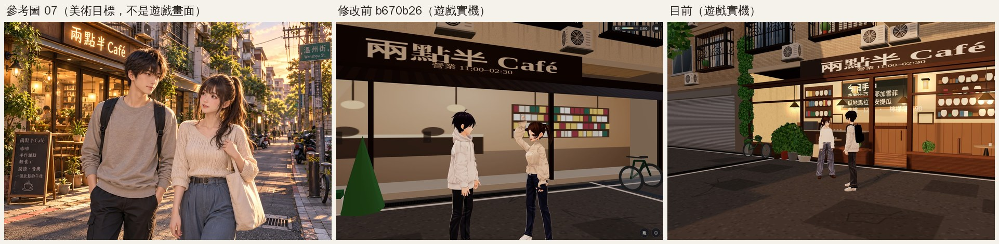

近景（看臉、服裝、配件）：

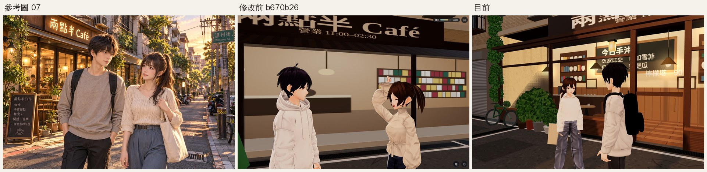

一般遊戲鏡頭（手機直向，含 HUD）。左邊是修改前，右邊是目前：

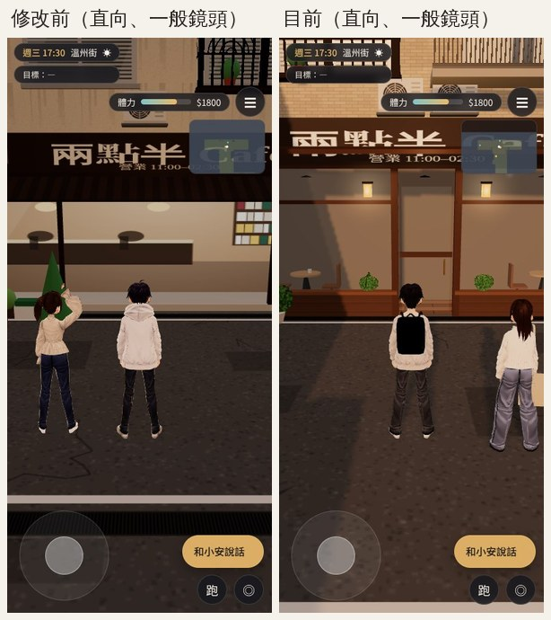

目前的大圖：[演出鏡頭](screenshots/v92_integration_ref_cine.jpg)、[近景](screenshots/v92_integration_closeup.jpg)、[橫向一般鏡頭](screenshots/v92_integration_follow_landscape.jpg)。

**差異（具體）**

| 項目 | 參考圖 | 修改前 | 目前 |
|---|---|---|---|
| 光線 | 低角度夕陽從街尾照進來，人物、店面、地面都有暖光與長影子 | Café 在巷子西端、門面朝東，傍晚整個門口在建築陰影裡，畫面灰褐，人物沒有影子 | Café 搬到東端路口，門面朝西。17:30 的夕陽沿著巷子照到店門口與人物，地上有人物的長影子 |
| Café 窗內 | 有深度的室內：吊燈、書架、桌椅、植物，暖黃光 | 玻璃後面是一張平面貼圖，吊燈是扁圓片，書架是色塊 | 玻璃後面是 3.4 m 深的真實室內：黃銅吊燈（發光）、後牆書架與瓶罐、黑板菜單（今日手沖、拿鐵 120、檸檬塔 90）、吧檯咖啡機、窗邊小桌與杯子、室內植物 |
| 店面材質 | 木框、玻璃、金屬燈具、爬藤、盆栽、A 字黑板 | 深色細框＋整片灰玻璃。門口的「盆栽」是綠色圓錐 | 木作窗框、窗下木牆板、木門（玻璃＋銅把手）、門兩側壁燈、兩側爬藤、葉片盆栽（不再是圓錐）、A 字立牌 |
| 祐廷 | 淺灰圓領上衣、黑色後背包、深色長褲、短髮 | 連帽上衣（帽子、口袋）、沒有背包、頭頂呆毛 | 淺灰圓領上衣（拿掉帽子、抽繩、口袋線）、黑色後背包、深灰直筒褲、白球鞋、拿掉呆毛 |
| 沈以安 | 米白針織衫、藍灰高腰寬褲、帆布托特包、高馬尾 | 泡泡袖襯衫、深藍窄褲、「說話」動作會把手舉到頭上、馬尾往後翹 | 米白針織衫、藍灰寬褲、樂福鞋、托特包。馬尾綁高後自然垂下，彈簧骨會擺動。說話動作修好（只點頭、身體微動） |
| 臉 | 半寫實日系臉、自然五官 | VRoid 動畫臉、大眼 | 眼睛縮小約 10–14%。仍是 VRoid 動畫臉，**BLOCKED_BY_ART_ASSET** |
| 構圖 | Café 在左、街道往右延伸、天空晚霞 | — | 目前的演出鏡頭以 Café 正面為主，看不到天空與街道延伸。下一步改成「從路口南側往北看」：Café 在左、主巷在右、夕陽從右邊照進來 |

**這次改了什麼**：
- `src/zones3d.js`：Café 搬到東端路口。回公館的出口改到路口南側，Café 北側補一棟轉角公寓。
- `src/townkit3d.js`：新增 `cafeFront`，做出有深度的室內、木窗框、壁燈、爬藤。盆栽改用葉片。
- `src/engine3d.js`：
  - 黃昏太陽方位改成接近正西，光線沿巷子照進來。
  - 演出鏡頭第一次轉場不會甩頭。
  - 彈簧骨改用固定小步長，低幀率時馬尾不會亂翹。
- `src/character3d.js`：加入配件、彈簧骨在人物座標系模擬、修正說話姿勢。
- `src/story3d.js`：同行的小安不會每 50 秒揮一次手。

**下一步**：
- 依參考圖構圖重拍：Café 在左、街景與晚霞在右。
- 人物改成並肩走路的姿勢。
- 托特包形狀再柔軟一點（現在看起來像紙板）。

---

## 2. 祐廷（參考圖 02）

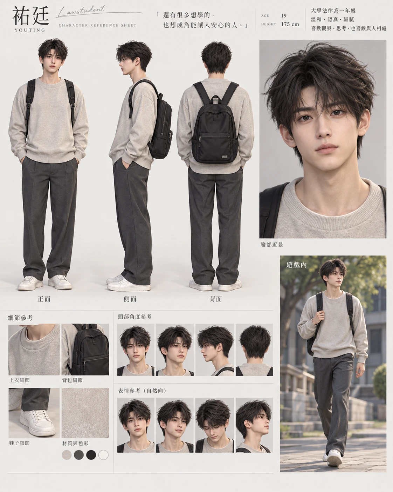

遊戲內（11:00，溫州街小公園前）：

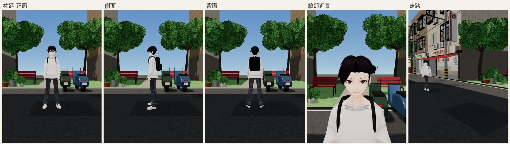

**差異**

| 檢查項目 | 結果 |
|---|---|
| 臉型、眼睛 | 部分符合。眼睛縮小後比較成熟，但仍是 VRoid 動畫臉，參考圖是半寫實臉（BLOCKED_BY_ART_ASSET） |
| 比例 | 符合。7.5 頭身、175 cm |
| 髮型、髮色 | 部分符合。黑色蓬鬆短髮、有瀏海、拿掉呆毛與塑膠反光。參考圖的頭髮更厚、更有層次 |
| 上衣 | 部分符合。淺灰圓領長袖，帽子、抽繩、口袋都拿掉了。白天看起來偏白，脖子後面有一圈原本帽子的領口 |
| 褲子 | 符合。深灰直筒、略寬 |
| 鞋子 | 符合。白球鞋 |
| 配件 | 部分符合。黑色後背包在畫面上偏全黑，看不出拉鍊和背帶細節 |
| 走路、坐下 | 走路是 Mixamo 動畫，腳步與移動速度大致一致。坐下時背包自動放下，不會和椅背穿插 |

**下一步**：上衣再灰一點；背包改成深炭灰，加上拉鍊、側袋的明暗。

## 3. 沈以安（參考圖 01）

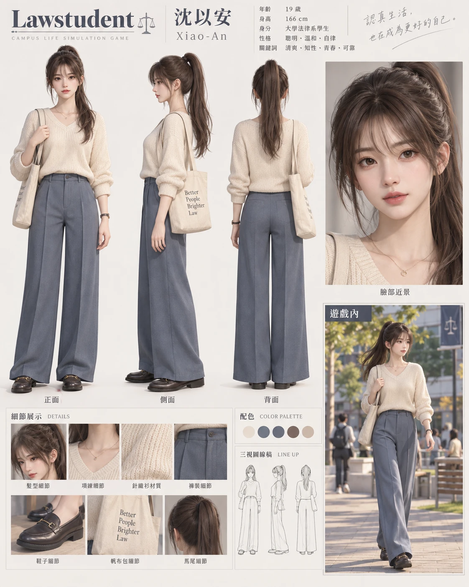

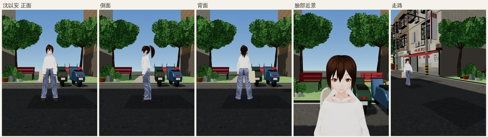

| 檢查項目 | 結果 |
|---|---|
| 臉、眼睛 | 部分符合。眼睛縮小 12–14%，仍是動畫臉（BLOCKED_BY_ART_ASSET） |
| 髮型 | 部分符合。單一高馬尾，從側面、背面看都對，走路會擺動。正面看像短鮑伯（瀏海偏厚），參考圖臉旁的長碎髮不夠長 |
| 髮色 | 符合。深棕 |
| 上衣 | 部分符合。米白寬鬆針織衫，有直條針織紋。參考圖是 V 領，目前是圓領（原本連帽上衣的領口）。腋下背後有兩個很小的接縫縫隙（已改成同色，近看才看得到） |
| 褲子 | 符合。藍灰直筒寬褲 |
| 鞋子 | 符合。深棕樂福鞋 |
| 配件 | 部分符合。米色托特包掛右肩，形狀偏硬。手錶、項鍊還沒有 |
| 和 2D 立繪是同一個人嗎 | 髮型與服裝方向一致（立繪是深色寬褲＋米色上衣＋高馬尾），臉的畫風不同 |

**下一步**：臉旁碎髮加長；V 領；托特包更軟；細手錶。

## 4. 其他四位女主角（參考圖 03、05、06）

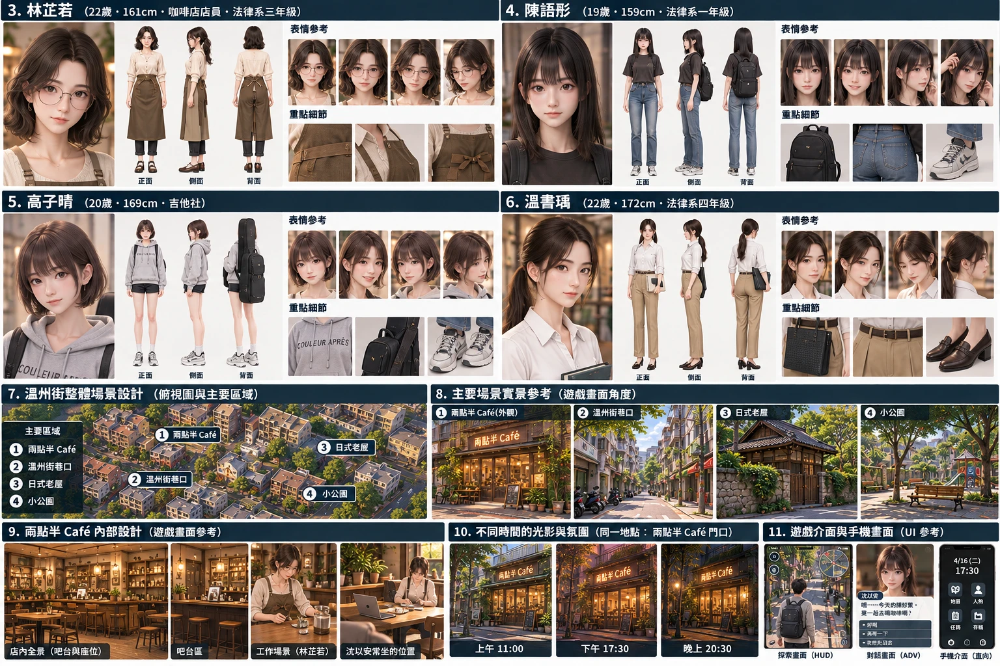

> 上一批遊戲內驗收照的背景混進了前一位角色，拍攝腳本已修正，正在重拍，重拍好的照片會補在這一節。下面是目前已確認的狀態（模型檢視＋遊戲內正面）。

| 人物 | 目前 | 和參考圖的差距 | 下一步 |
|---|---|---|---|
| 林芷若 | Victoria 改作：黑色及肩髮、米色亞麻長袖上衣（拿掉原本的制服短袖＋背心）、淺灰直筒寬褲、深色樂福鞋。細框眼鏡、銀耳環是配件，咖啡色圍裙在咖啡廳工作時才顯示 | 頭髮是直的、瀏海太齊，參考圖是自然微捲。頭頂有一撮翹起的髮束 | 找出那撮翹髮刪掉。微捲要換髮型素材（BLOCKED_BY_ART_ASSET） |
| 陳語彤 | Shibu 改作：黑色齊肩直髮、髮尾內彎、寬鬆深灰 T 恤（由連帽上衣剪成短袖、拿掉帽子）、牛仔褲、白球鞋、黑色後背包 | T 恤沒有參考圖的小印花，牛仔褲顏色偏亮 | 加小印花、褲色加深 |
| 高子晴 | Vita 改作：深棕短髮、淺灰連帽外套、短褲、白球鞋、黑色吉他袋 | 頭髮在遊戲裡（物理模擬後）會往上翹；手腕殘留原模型的深色手套痕跡；短褲應該是牛仔短褲 | 調頭髮彈簧骨；把手腕貼圖補成膚色 |
| 溫書瑀 | Shino 改作：卡其寬褲、深色樂福鞋、判決節錄資料夾 | **上衣仍像制服背心**（白背心＋羅紋下擺）；低馬尾是硬拉出來的，側面有奇怪的髮束；髮色偏黑 | 換成真的白襯衫；低馬尾改用跟沈以安一樣的作法（但用不同髮束，避免撞造型） |

## 5. 六人同框（身高與風格對照，參考圖 03）

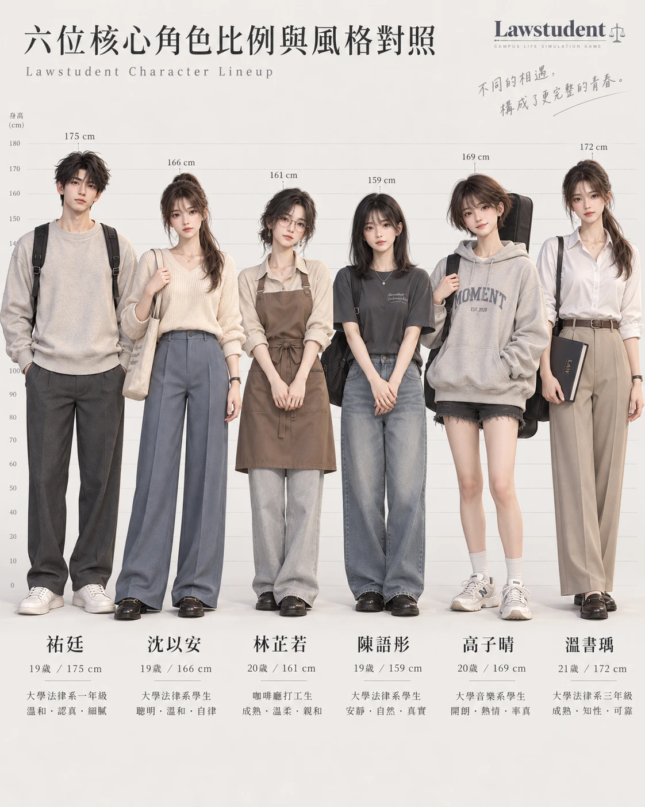

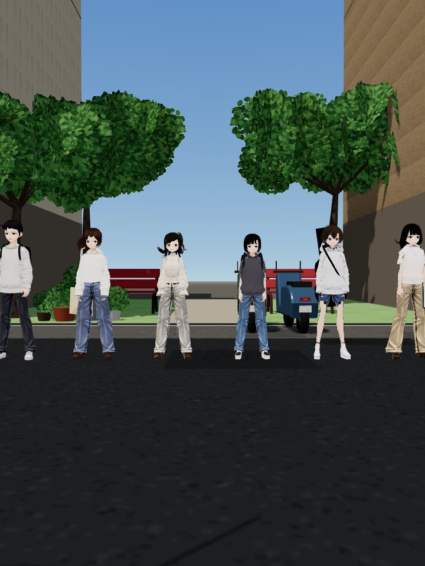

身高照正式設定：祐廷 175 > 溫書瑀 172 > 高子晴 169 > 沈以安 166 > 林芷若 161 > 陳語彤 159。每個人都有自己的模型與服裝，不是同一個路人模型換色。

## 6. 兩點半 Café 門口

見第 1 節的近景與演出鏡頭。招牌是正確的繁體中文「兩點半 Café ／ 營業 11:00–02:30」，傍晚以後字會亮。窗內的配置和店內區域一致：吧檯在左後、窗邊雙人桌、書架在右後。

## 7. 天空與遠景（使用者 2026-10-09：「天空都是很藍很單調，應該要看得到外面、遠方、天際線」）

同一個位置（溫州街東端往西看）的 11:00／17:30／20:30，加上從小公園往外看的 11:00：

| 11:00 | 17:30 |
|---|---|
| 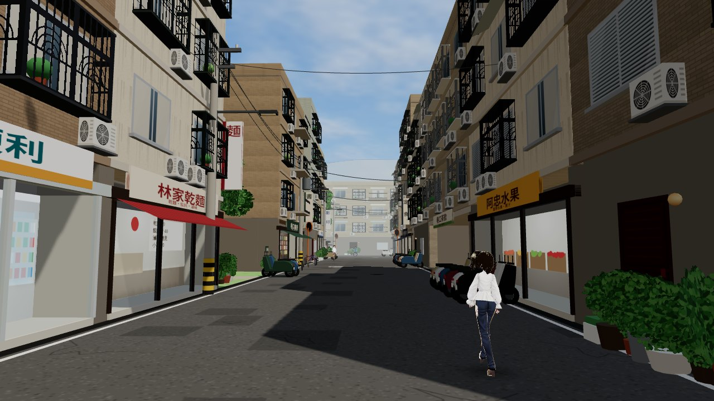 | 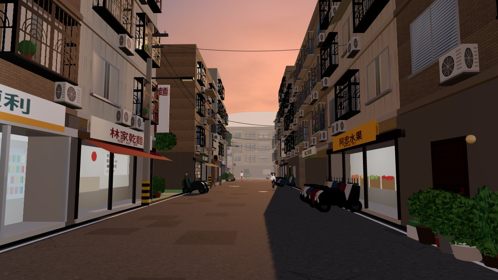 |
| **20:30** | **小公園 11:00** |
| 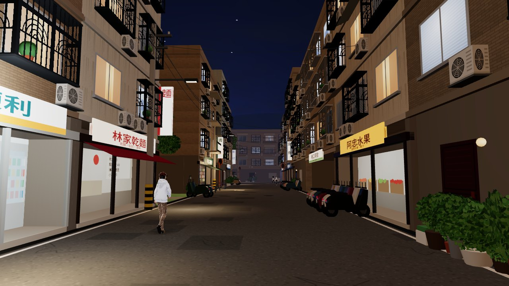 | 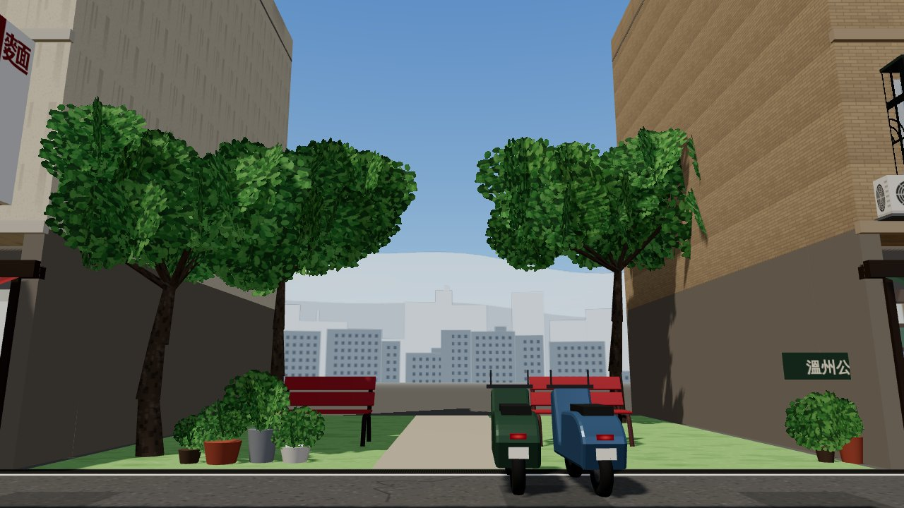 |

修改前的天空是一層藍色漸層，建築上方和巷子盡頭後面什麼都沒有，可以對照第 2–4 節的人物照背景。

這次加了：
- 會飄動的程序雲：白天白雲、黃昏染夕陽色、陰雨天雲變多變灰。
- 夜晚星星。
- 兩圈遠景：
  - 台北市區大樓剪影，前排深、後排淡，晚上窗戶亮燈。
  - 台北盆地的山稜線，有台北 101 的遠景剪影。
- 只在室外區域顯示。

**還不夠的地方**：白天的雲量偏少；遠山顏色偏白，看起來像一片雲牆。下一步會調多一點雲，山改成藍灰色。

## 8. 校園：依臺大校總區平面圖重新配置（v9.3）

使用者 2026-10-09：「校園內場景可以參考台大校園圖」，並提供臺大校總區平面圖（2025.10.13 版）。地圖有著作權，**不放進公開 repo**，官方網址是 https://map.ntu.edu.tw 。下面的俯視圖是遊戲本身的算圖（`tools/shots/campus_overview.py`，暫時關掉霧和天空），用 `tools/shots/annotate_overview.py` 標上地標名稱，可以拿來和平面圖對照：

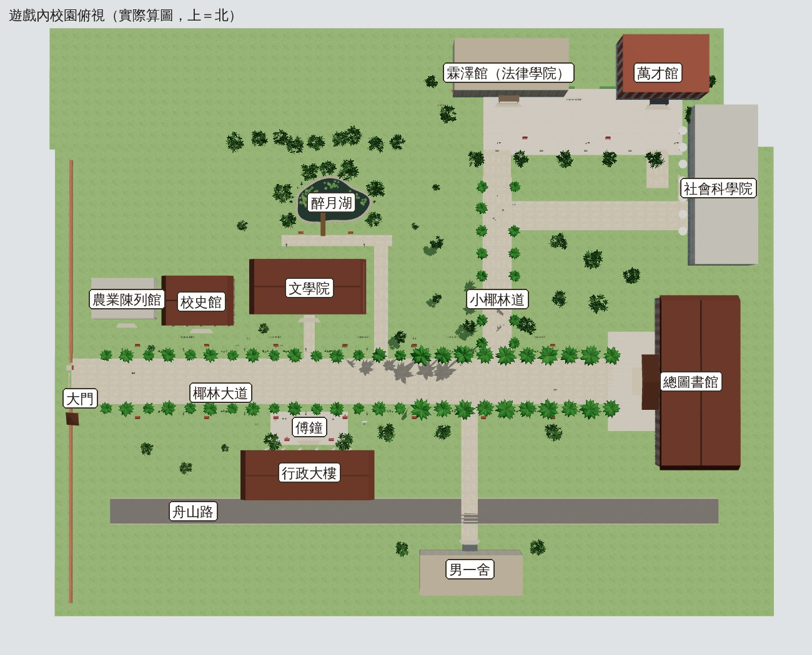

| 地標 | 平面圖上 | 修改前（v9.2） | 現在（v9.3） |
|---|---|---|---|
| 總圖書館 | 椰林大道東端盡頭 | 在大道北側草坪後面；大道盡頭是校史館 | 大道東端，正面朝西對著整條大道；門口改成正確的三角山牆（舊版是一個黑色尖錐，還擋住館名） |
| 傅鐘 | 大道南側、行政大樓前 | 大道北側的小廣場 | 大道南側、行政大樓正前方，旁邊兩張長椅 |
| 行政大樓 | 傅鐘後面 | 靠校門的南側 | 傅鐘後面，柱廊朝北對著大道 |
| 文學院 | 大道北側，正對行政大樓 | 北側偏西 | 正對行政大樓，門前小路通到大道 |
| 校史館 | 大道北側、靠大門 | 大道東端（擋在總圖該在的位置） | 靠大門、農業陳列館東邊 |
| 醉月湖 | 文學院北邊 | 沒有（只有一條「往醉月湖」的小路） | 湖面、石砌湖岸、湖心亭＋木棧道（走得上去）、睡蓮葉、湖畔長椅與路燈 |
| 小椰林道 | 從椰林大道往北 | 一條沒有樹的路 | 兩排大王椰子 |
| 大王椰子 | 筆直灰白樹幹、綠色葉鞘、拱形羽狀葉 | 彎曲的低多邊形椰子樹（不像台大） | 程序化大王椰子（`TK.royalPalm`） |
| 其他樹 | — | 方塊葉 GLB 樹、針葉樹 | 闊葉樹（和溫州街同一套） |
| 椰林大道中間 | 沒有分隔島 | 花圃分隔島（綠色方塊＋粉紅球） | 拿掉；兩側椰子樹之間改成杜鵑綠叢（開學的九月不開花） |

同一個鏡頭的修改前／後（左：v9.2 `f3254d5`，右：v9.3；都是實際遊戲畫面）：

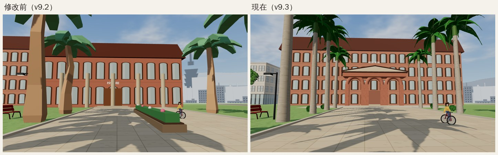

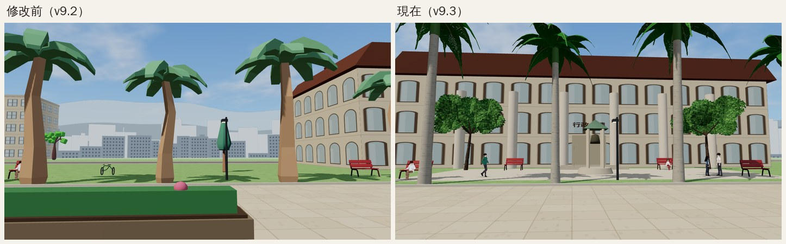

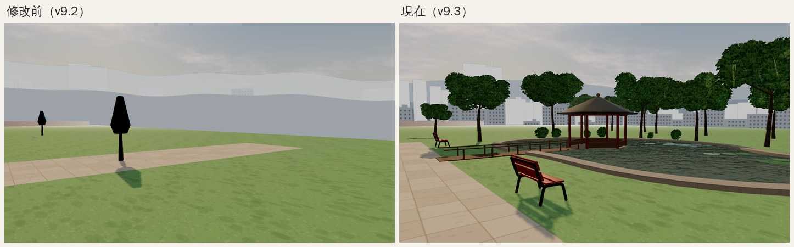

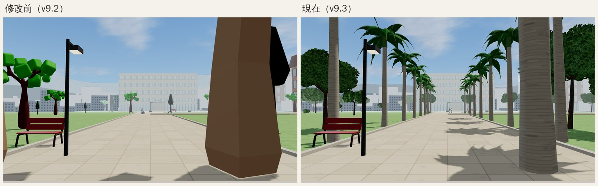

手機橫向、一般跟隨鏡頭（不是演出鏡頭），祐廷沿椰林大道往總圖走：

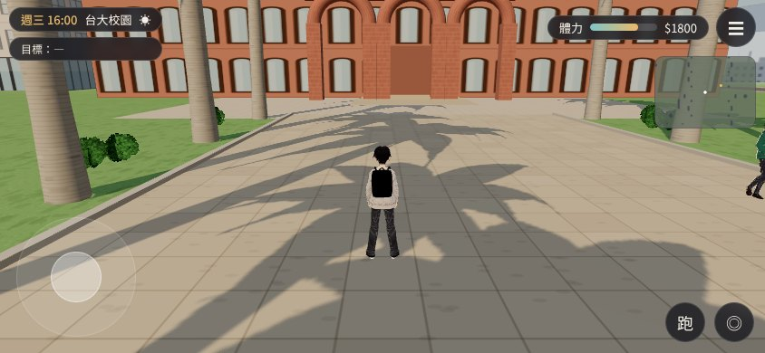

**刻意和真實不同的地方**（決策 D25）：
- 法律學院（霖澤館、萬才館）放在小椰林道北端，不在最東北的辛亥路口。
- 社會科學院在總圖北邊。
- 舟山路改成行政大樓後面的東西向直路。
- 醉月湖離大道比較近。
- 整體大約壓成 1:3.7。

原因有兩個：
- 霖澤館、宿舍、校門的位置都沒動，舊存檔和回歸測試的出生點不受影響。
- 手機上照真實比例走 700 m 太久。

**還不夠的地方**：
- 建築仍然是 LEVEL_BLOCKOUT 方盒：總圖、行政大樓、文學院只有立面窗格，沒有台大建築特有的洗石子、拱廊、屋瓦細節。
- 平面圖上幾十棟系館大多沒有蓋。
- 傅鐘的造型是簡化的小鐘亭。
- 醉月湖水面只反射天空顏色和一條樹影色帶，沒有真正的倒影。

狀態：配置與導航 **技術完成**；美術 `READY_FOR_ART_REVIEW`。
