# 視覺驗收報告（VISUAL_REVIEW）

每個重要畫面都依「**參考圖 → 目前實際遊戲截圖 → 差異 → 這次改了什麼 → 下一步**」整理。規範見 [`ART_DIRECTION.md`](ART_DIRECTION.md)，參考圖在 [`references/`](references/)。

**截圖怎麼來的**：全部是實際執行 Three.js 遊戲後的畫面。用 Playwright 開 Chromium（SwiftShader 軟體算圖），並不是手機實機。鏡頭位置與人物站位由腳本設定（類似拍照模式），畫面由遊戲引擎即時算圖，沒有合成，也沒有用參考圖當背景。拍攝腳本：
- `tools/shots/scene_shot.py`：場景畫面
- `tools/shots/char_turnaround.py`：人物正面／側面／背面／臉部／走路／六人同框
- `tools/shots/compare.py`：並排比較

**狀態用語**：
- 技術完成：程式正常執行。
- 功能完成：玩家能用，和其他系統整合正確。
- `READY_FOR_ART_REVIEW`：等使用者看過。
- `BLOCKED_BY_ART_ASSET`：缺素材，做不到參考圖的品質。

主要美術在使用者看過之前，一律不寫「美術完成」。

最近更新：2026-10-09（v9.3 第六批：校園四棟主要建築換成台大風格的外觀，第 8 節）。

## 狀態總表

| 畫面 | 技術 | 功能 | 美術 | 一句話 |
|---|---|---|---|---|
| 1. 祐廷 × 沈以安 × Café × 黃昏 | 完成 | 完成（同行劇情狀態） | READY_FOR_ART_REVIEW（部分 BLOCKED_BY_ART_ASSET：臉） | 照參考圖 07 的構圖拍中景：Café 在左、路往北延伸到晚霞、兩人並肩走。光線還不夠金、臉仍是 VRoid 動畫臉 |
| 2. 祐廷 | 完成 | 完成 | READY_FOR_ART_REVIEW／臉 BLOCKED_BY_ART_ASSET | 淺灰圓領上衣（中午不再曝白）、深灰直筒褲、白球鞋、看得到明暗與背帶的黑色後背包 |
| 3. 沈以安 | 完成 | 完成 | READY_FOR_ART_REVIEW／臉 BLOCKED_BY_ART_ASSET | 單一高馬尾（會擺動）、米白圓領針織衫、藍灰寬褲、樂福鞋、托特包 |
| 4. 林芷若 | 完成 | 完成 | PARTIAL | 細框眼鏡（鏡腳方向修好）、米色上衣改圓領、米灰寬褲；站著、走路的頭髮都自然下垂（第 4 節）。頭髮是直的，Bible 是微捲（BLOCKED_BY_ART_ASSET） |
| 5. 陳語彤 | 完成 | 完成 | READY_FOR_ART_REVIEW | 圓領深灰 T 恤＋牛仔褲＋後背包、黑髮接近齊肩；T 恤沒有印花 |
| 6. 高子晴 | 完成 | 完成 | READY_FOR_ART_REVIEW | 淺灰連帽外套＋黑短褲＋白球鞋＋吉他袋；呆毛、臉頰花紋、手套殘影、短褲布片都拿掉 |
| 7. 溫書瑀 | 完成 | 完成 | READY_FOR_ART_REVIEW | 深棕低馬尾＋髮圈（側面、背面看得出是馬尾）、白襯衫反摺長袖、卡其直筒褲、資料夾 |
| 8. 兩點半 Café 門口 | 完成 | 完成 | READY_FOR_ART_REVIEW | 玻璃後面看得到室內、暖色吊燈、木窗框、壁燈、爬藤、繁中招牌 |
| 9. 天空與遠景 | 完成 | 完成 | READY_FOR_ART_REVIEW | 雲、晚霞、星星、遠方台北市區與山稜線 |
| 10. 巷口（東端路口） | 完成 | 完成 | READY_FOR_ART_REVIEW | Café 在路口、轉角公寓、斑馬線、行道樹；路口往北延伸到天空（可走範圍用施工護欄擋住） |
| 11. 日式老屋、小公園 | 完成 | 完成 | READY_FOR_ART_REVIEW | 老屋從巷子看得到木造外觀與玄關、寄棟屋頂；公園有大樹＋樹圍座椅、路燈、睡覺的貓（第 9 節） |
| 12. 三時段光影（同一位置） | 完成 | — | READY_FOR_ART_REVIEW（黃昏仍偏暗，需要使用者看過） | Café 門口、小公園各有 11:00／17:30／20:30（第 10 節）；晚上 Café 櫥窗暖光灑到路面、北側路燈；黃昏只微調 |
| 13. 校園依台大校園圖 | 完成 | 完成（導航測試見第 8 節） | READY_FOR_ART_REVIEW | 總圖在大道東端、傅鐘＋行政大樓在南側、文學院正對面、醉月湖（湖心亭走得上去）、小椰林道、大王椰子；行政大樓、文學院、校史館、總圖換成面磚／紅磚、拱窗、一樓拱廊、石材門廊、四坡屋頂（其他系館仍是方盒） |

---

## 1. 整合場景：祐廷 × 沈以安 × 兩點半 Café × 黃昏

參考圖 07 ↔ 修改前（`b670b26`）↔ 目前（同一個劇情狀態：小安同行、17:30）：

近景（看臉、服裝、配件）：

一般遊戲鏡頭（手機直向，含 HUD）。左邊是修改前，右邊是目前：

目前的大圖：[演出鏡頭](screenshots/v92_integration_ref_cine.jpg)、[近景](screenshots/v92_integration_closeup.jpg)、[橫向一般鏡頭](screenshots/v92_integration_follow_landscape.jpg)。

**差異（具體）**

| 項目 | 參考圖 | 修改前 | 目前 |
|---|---|---|---|
| 光線 | 低角度夕陽從街尾照進來，人物、店面、地面都有暖光與長影子 | Café 在巷子西端、門面朝東，傍晚整個門口在建築陰影裡，畫面灰褐，人物沒有影子 | Café 搬到東端路口，門面朝西。17:30 的夕陽沿著巷子照到店門口與人物，地上有人物的長影子 |
| Café 窗內 | 有深度的室內：吊燈、書架、桌椅、植物，暖黃光 | 玻璃後面是一張平面貼圖，吊燈是扁圓片，書架是色塊 | 玻璃後面是 3.4 m 深的真實室內：黃銅吊燈（發光）、後牆書架與瓶罐、黑板菜單（今日手沖、拿鐵 120、檸檬塔 90）、吧檯咖啡機、窗邊小桌與杯子、室內植物 |
| 店面材質 | 木框、玻璃、金屬燈具、爬藤、盆栽、A 字黑板 | 深色細框＋整片灰玻璃。門口的「盆栽」是綠色圓錐 | 木作窗框、窗下木牆板、木門（玻璃＋銅把手）、門兩側壁燈、兩側爬藤、葉片盆栽（不再是圓錐）、A 字立牌 |
| 祐廷 | 淺灰圓領上衣、黑色後背包、深色長褲、短髮 | 連帽上衣（帽子、口袋）、沒有背包、頭頂呆毛 | 淺灰圓領上衣（拿掉帽子、抽繩、口袋線）、黑色後背包、深灰直筒褲、白球鞋、拿掉呆毛 |
| 沈以安 | 米白針織衫、藍灰高腰寬褲、帆布托特包、高馬尾 | 泡泡袖襯衫、深藍窄褲、「說話」動作會把手舉到頭上、馬尾往後翹 | 米白針織衫、藍灰寬褲、樂福鞋、托特包。馬尾綁高後自然垂下，彈簧骨會擺動。說話動作修好（只點頭、身體微動） |
| 臉 | 半寫實日系臉、自然五官 | VRoid 動畫臉、大眼 | 眼睛縮小約 10–14%。仍是 VRoid 動畫臉，**BLOCKED_BY_ART_ASSET** |
| 構圖 | Café 在左、街道往右延伸、天空晚霞 | — | 目前的演出鏡頭以 Café 正面為主，看不到天空與街道延伸。下一步改成「從路口南側往北看」：Café 在左、主巷在右、夕陽從右邊照進來 |

**這次改了什麼**：
- `src/zones3d.js`：Café 搬到東端路口。回公館的出口改到路口南側，Café 北側補一棟轉角公寓。
- `src/townkit3d.js`：新增 `cafeFront`，做出有深度的室內、木窗框、壁燈、爬藤。盆栽改用葉片。
- `src/engine3d.js`：
  - 黃昏太陽方位改成接近正西，光線沿巷子照進來。
  - 演出鏡頭第一次轉場不會甩頭。
  - 彈簧骨改用固定小步長，低幀率時馬尾不會亂翹。
- `src/character3d.js`：加入配件、彈簧骨在人物座標系模擬、修正說話姿勢。
- `src/story3d.js`：同行的小安不會每 50 秒揮一次手。

### v9.3：照參考圖 07 的構圖重拍（並肩走過 Café，中景）

拍法：鏡頭在路口南側往北看，Café 門面在左，夕陽從右邊（西）照過來。兩個人是真的在走：玩家走導航路徑，同行的小安走同方向的路線（間隔 0.85 m），頭轉向祐廷。腳本 `tools/shots/integration_walk.py` 連拍 12 張，挑走路姿勢最好、離鏡頭約 2–3 m 的一張。

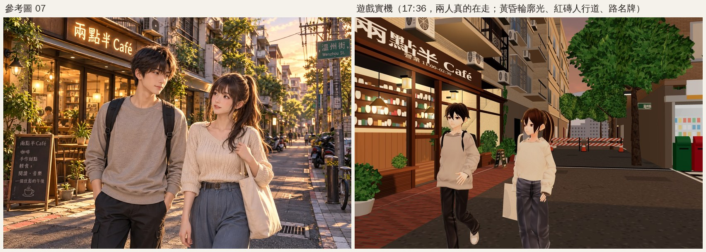

**這次改了什麼**：
- 構圖：從遠景改成中景，兩人走到鏡頭前約 2.5 m。
- 街尾：路口往北原本被一棟 6 樓公寓整個擋住。現在是往北延伸的路、兩側遠景公寓、行道樹，盡頭是天空；可走範圍用道路施工護欄擋住（不是隱形牆）。
- 光線：17:00–18:00 的陽光與天空略調亮、偏暖，雲的陰影不再偏紫。**效果很小**（畫面平均亮度約 +3%，第 10 節有修改前後對照）。
- 黃昏輪廓光（v9.3 第三批）：17:00–18:40 人物的頭髮邊緣有暖金色的光，上衣邊緣淡淡的一層；褲子、鞋子、皮膚、臉不加（深色褲子加了會變成偏棕的塑膠光澤，試過之後拿掉）。白天、夜晚、室內不會出現。左：沒有輪廓光，右：目前：

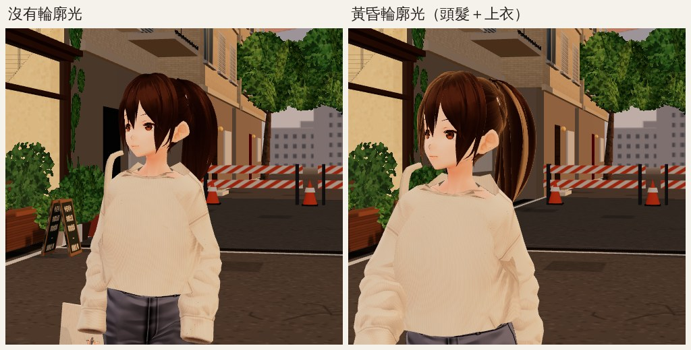
- 街道細節（v9.3 第四、五批）：Café 門前的紅磚人行道（外緣一條低路緣；平的，不影響走路）、路口的綠色「溫州街 Wenzhou St.」路名牌（台北常見的樣式）、路口往北那段路邊停一排機車、一根電線桿和電線。

**和參考圖還差什麼**：
- 臉：VRoid 動畫臉（BLOCKED_BY_ART_ASSET）。
- 光：參考圖是很強的逆光，人物和地面都被染成金色；遊戲裡頭髮已有暖色輪廓光，但臉、地面、整體仍比參考圖暗、不夠金。
- 街道細節：紅磚人行道、路名牌、路邊機車、電線桿已補上；參考圖的街道更長、更密（一路延伸的店面、遠處的行人），遊戲裡往北走到施工護欄為止。
- 兩人的距離：參考圖是肩並肩；遊戲裡間隔 0.85 m（實際同行時的跟隨距離約 0.95 m）。

**下一步**：
- 托特包形狀再柔軟一點（現在看起來像紙板）。

---

## 2. 祐廷（參考圖 02）

遊戲內（11:00，溫州街小公園前，v9.3）：

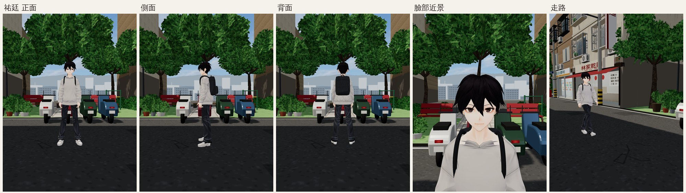

**差異**

| 檢查項目 | 結果 |
|---|---|
| 臉型、眼睛 | 部分符合。眼睛縮小後比較成熟，但仍是 VRoid 動畫臉，參考圖是半寫實臉（BLOCKED_BY_ART_ASSET） |
| 比例 | 符合。7.5 頭身、175 cm |
| 髮型、髮色 | 部分符合。黑色蓬鬆短髮、有瀏海、拿掉呆毛與塑膠反光。右側有一撮比較尖的翹髮；參考圖的頭髮更厚、更柔 |
| 上衣 | 符合（v9.3）。淺灰圓領長袖：中午不再曝成全白（衣服材質亮部壓低）；領口只剩一個很小的 V 形缺口 |
| 褲子 | 符合。深灰直筒、略寬 |
| 鞋子 | 符合。白球鞋 |
| 配件 | 符合（v9.3）。黑色後背包：修正材質顏色相乘後，看得到明暗、背帶 |
| 走路、坐下 | 走路是 Mixamo 動畫，腳步與移動速度大致一致。坐下時背包自動放下，不會和椅背穿插 |

**下一步**：頭髮更厚、更柔（需要新的髮型素材，BLOCKED_BY_ART_ASSET）。

## 3. 沈以安（參考圖 01）

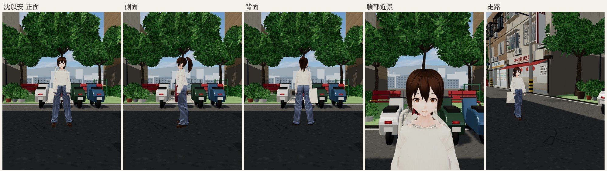

| 檢查項目 | 結果 |
|---|---|
| 臉、眼睛 | 部分符合。眼睛縮小 12–14%，仍是動畫臉（BLOCKED_BY_ART_ASSET） |
| 髮型 | 部分符合。單一高馬尾，從側面、背面看都對，走路會擺動。正面看像短鮑伯（瀏海偏厚），參考圖臉旁的長碎髮不夠長 |
| 髮色 | 符合。深棕 |
| 上衣 | 部分符合。米白寬鬆針織衫，有直條針織紋，中午看得出米白色（v9.3）。領口改成圓領：原本是帽子拿掉後留下的立領，看起來像襯衫領片。參考圖是 V 領；Character Bible 只寫「針織上衣」，所以用圓領 |
| 褲子 | 符合。藍灰直筒寬褲 |
| 鞋子 | 符合。深棕樂福鞋 |
| 配件 | 部分符合。米色托特包掛右肩；v9.3 第六批改軟（見下圖）。手錶、項鍊還沒有 |
| 和 2D 立繪是同一個人嗎 | 髮型與服裝方向一致（立繪是深色寬褲＋米色上衣＋高馬尾），臉的畫風不同 |

v9.3 第六批：托特包改軟。原本是完美的長方形，看起來像紙板。現在上緣在兩條提帶之間往下垂、底部被裝的東西撐得比較鼓、下方兩角是圓的、布面有幾道淺皺褶。同一個鏡頭的實際遊戲畫面（上：站著；下：走路）：

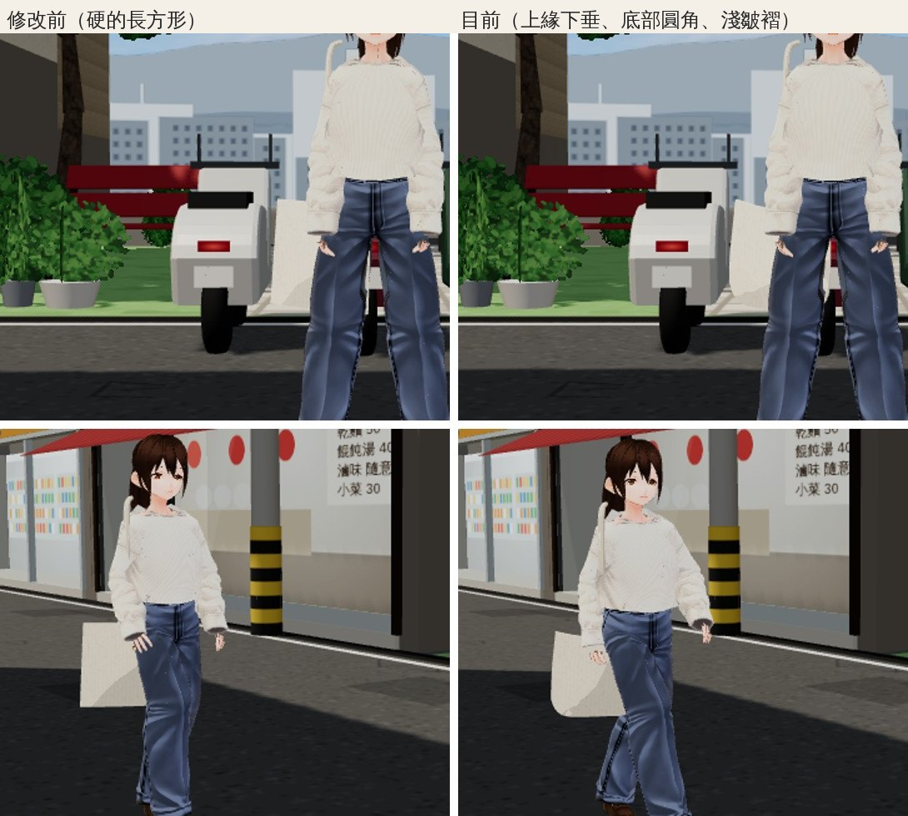

改變不大，近看才看得出來；仍是一片布做成的包，沒有包口的厚度和內裡。

**下一步**：臉旁碎髮加長；細手錶。

## 4. 其他四位女主角（參考圖 03、05、06）

遊戲內（11:00，溫州街小公園前；正面／側面／背面／臉部近景／走路）。林芷若、溫書瑀這一批改得比較多，上面是修改前（v9.3 第一批），下面是目前：

**林芷若**

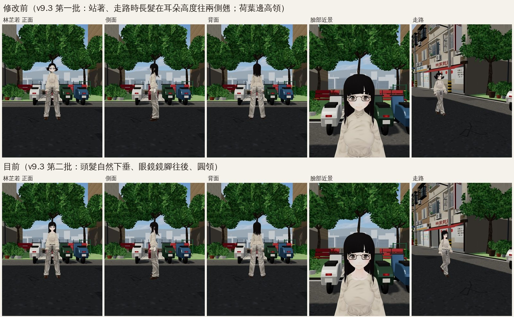

**溫書瑀**

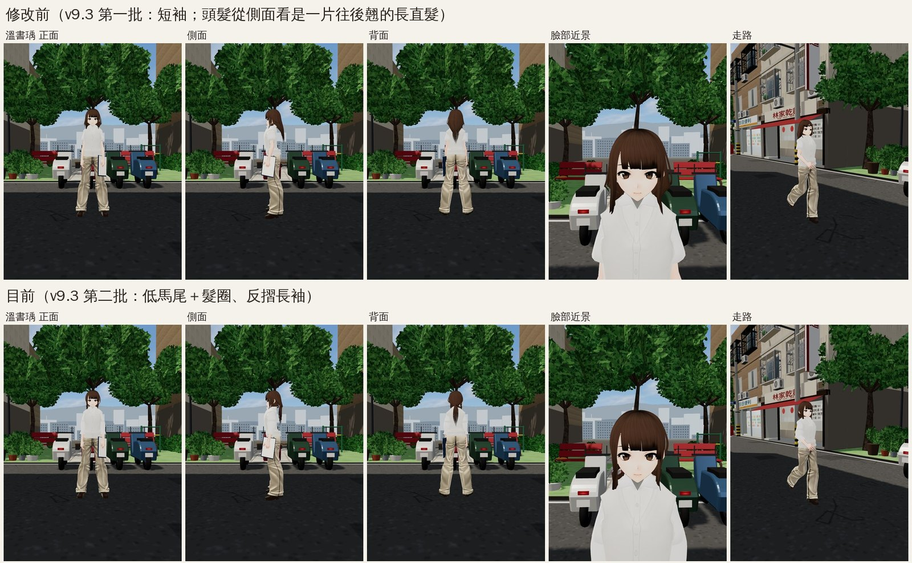

**陳語彤**（第三批：圓領兩側的尖角拿掉）、**高子晴**（第五批：臉旁的白色毛邊拿掉）：

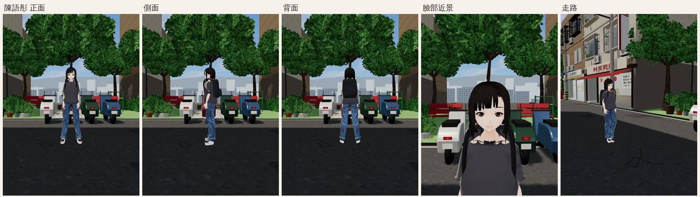

陳語彤臉部近景的領口，左：修改前，右：目前：

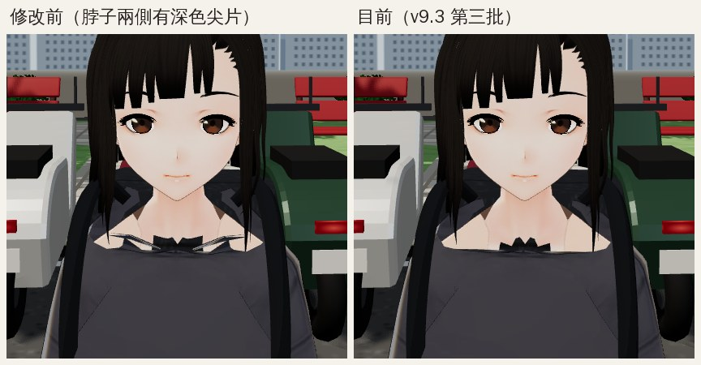

第六批：領口正中間有一個深色的小蝴蝶結。幾何上沒有東西（模型算圖是平順的圓領），所以判斷是貼圖。第一次以為是領口上緣一圈很窄的布還在用帽子貼圖的尖端，改成素面布料的貼圖座標之後，臉部近景**還是一樣**（下圖左：第三批，右：第六批）。真正原因是胸口貼圖本身在領口正中間畫了帽子兩邊交疊的 V 形陰影，下一批修：

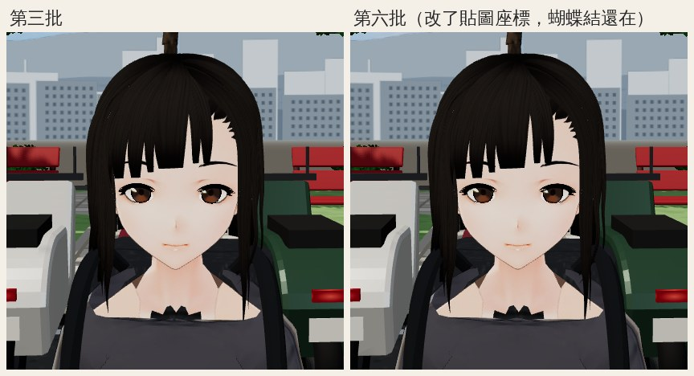

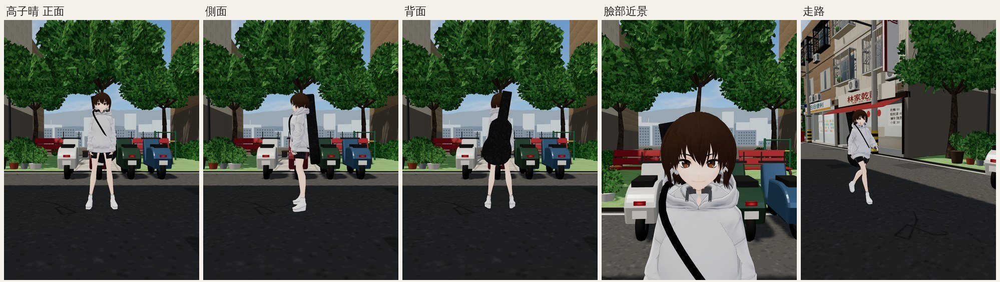

高子晴臉部近景，左：修改前，右：目前。原本臉頰兩側頭髮的縫隙裡露出白色的毛邊——不是髮尾，是立在後腦勺的帽子（比頭寬），從正面透過頭髮縫隙看得到；現在帽子往中間收窄、臉旁的帽緣壓低：

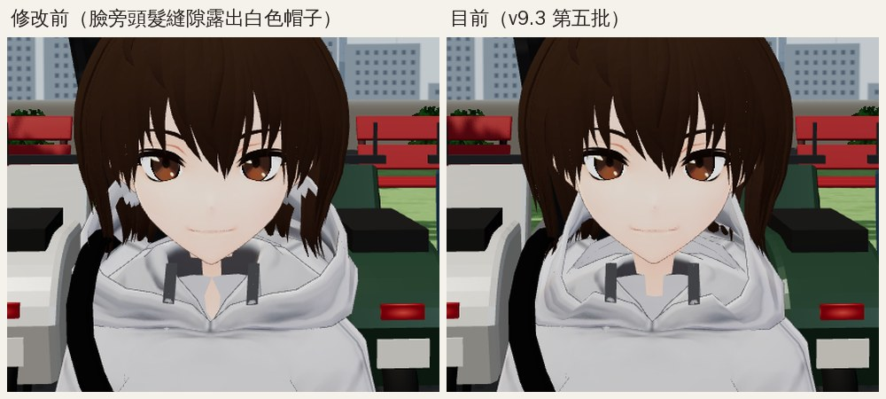

| 人物 | 改了什麼 | 和參考圖／Character Bible 還差什麼 | 狀態 |
|---|---|---|---|
| 林芷若 | 第一批：拿掉頭頂翹起的側馬尾殘段、眼睛青色反光換白色、眉毛改深色、細框眼鏡。**第二批**：走路與剛出現時長髮在耳朵高度往兩側翹——真正原因是彈簧骨用上一幀的骨頭位置算骨長（不是手臂碰撞體，那是第一批的錯誤判斷），修好後頭髮自然下垂；眼鏡鏡腳原本從臉前面伸出去，改成往後到耳朵；荷葉邊高領剪成圓領，露出脖子和鎖骨 | 頭髮是直的，Bible 是「微捲」（BLOCKED_BY_ART_ASSET：VRoid 樣本沒有捲髮）；上衣袖口仍是荷葉邊，參考圖是一般袖口 | PARTIAL |
| 陳語彤 | T 恤改成圓領：原本是帽子剪掉後留下的漏斗領。下擺、袖口收平（原本是鋸齒）；黑髮不再偏藍；眉毛從深藍改深色；拿掉 7 字髮夾；頭髮拉長接近齊肩；牛仔褲加深。第三批：圓領兩側的尖角拿掉 | T 恤沒有參考圖的小印花；領口正中間有一個深色小蝴蝶結（第六批第一次修錯，見下圖；下一批修） | READY_FOR_ART_REVIEW |
| 高子晴 | 拿掉頭頂兩撮呆毛、臉頰的科幻花紋（含淡綠光暈）、手上的手套殘影、短褲中間垂下的布片；黑色短褲；眉毛眼線從淺藍灰改深棕；連帽外套改淺灰；吉他袋看得到布紋。**第五批**：臉旁頭髮縫隙裡的白色毛邊拿掉（是立在後腦勺、比頭寬的帽子，不是髮尾）：帽子往中間收窄、臉旁帽緣壓低 | 連帽外套沒有參考圖的字樣印花 | READY_FOR_ART_REVIEW |
| 溫書瑀 | 第一批：白襯衫（背心的 V 領線、描邊、粉紅陰影拿掉，畫上門襟和鈕扣）、深棕髮、拿掉 X 髮夾、卡其直筒褲。**第二批**：低馬尾——兩側與後面的頭髮沿著頭的弧面收到後頸、深色髮圈、綁點以下收成一束沿著背垂下，臉旁前髮剪到下巴（原本只是往下逐漸收窄，側面看是一片往後翹的長直髮）；袖子從短袖接長到前臂，最後一段做成鼓起的反摺袖口 | 馬尾是剛體，不會隨走路擺動；反摺袖口沒有布料的折痕貼圖 | READY_FOR_ART_REVIEW |

## 5. 六人同框（身高與風格對照，參考圖 03）

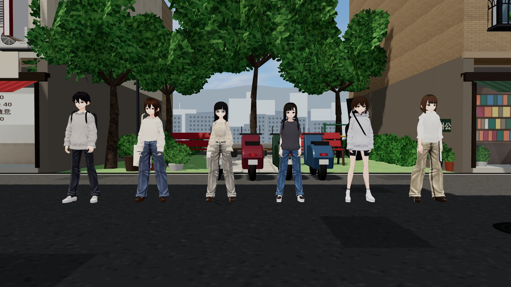

身高照正式設定：祐廷 175 > 溫書瑀 172 > 高子晴 169 > 沈以安 166 > 林芷若 161 > 陳語彤 159。每個人都有自己的模型與服裝，不是同一個路人模型換色。

v9.3 中午的淺色衣服都看得出顏色：
- 祐廷：淺灰
- 沈以安：米白
- 林芷若：米色
- 高子晴：淺灰
- 溫書瑀：白

修改前（`screenshots/v92_lineup_six_WIP.jpg`）幾乎全部曝成白色。

## 6. 兩點半 Café 門口

見第 1 節的近景與演出鏡頭。招牌是正確的繁體中文「兩點半 Café ／ 營業 11:00–02:30」，傍晚以後字會亮。窗內的配置和店內區域一致：吧檯在左後、窗邊雙人桌、書架在右後。

## 7. 天空與遠景（使用者 2026-10-09：「天空都是很藍很單調，應該要看得到外面、遠方、天際線」）

同一個位置（溫州街東端往西看）的 11:00／17:30／20:30，加上從小公園往外看的 11:00：

| 11:00 | 17:30 |
|---|---|
|  |  |
| **20:30** | **小公園 11:00** |
|  |  |

修改前的天空是一層藍色漸層，建築上方和巷子盡頭後面什麼都沒有，可以對照第 2–4 節的人物照背景。

這次加了：
- 會飄動的程序雲：白天白雲、黃昏染夕陽色、陰雨天雲變多變灰。
- 夜晚星星。
- 兩圈遠景：
  - 台北市區大樓剪影，前排深、後排淡，晚上窗戶亮燈。
  - 台北盆地的山稜線，有台北 101 的遠景剪影。
- 只在室外區域顯示。

**還不夠的地方**：白天的雲量偏少；遠山顏色偏白，看起來像一片雲牆。下一步會調多一點雲，山改成藍灰色。

## 8. 校園：依臺大校總區平面圖重新配置（v9.3）

使用者 2026-10-09：「校園內場景可以參考台大校園圖」，並提供臺大校總區平面圖（2025.10.13 版）。地圖有著作權，**不放進公開 repo**，官方網址是 https://map.ntu.edu.tw 。下面的俯視圖是遊戲本身的算圖（`tools/shots/campus_overview.py`，暫時關掉霧和天空），用 `tools/shots/annotate_overview.py` 標上地標名稱，可以拿來和平面圖對照：

| 地標 | 平面圖上 | 修改前（v9.2） | 現在（v9.3） |
|---|---|---|---|
| 總圖書館 | 椰林大道東端盡頭 | 在大道北側草坪後面；大道盡頭是校史館 | 大道東端，正面朝西對著整條大道；門口改成正確的三角山牆（舊版是一個黑色尖錐，還擋住館名） |
| 傅鐘 | 大道南側、行政大樓前 | 大道北側的小廣場 | 大道南側、行政大樓正前方，旁邊兩張長椅 |
| 行政大樓 | 傅鐘後面 | 靠校門的南側 | 傅鐘後面，柱廊朝北對著大道 |
| 文學院 | 大道北側，正對行政大樓 | 北側偏西 | 正對行政大樓，門前小路通到大道 |
| 校史館 | 大道北側、靠大門 | 大道東端（擋在總圖該在的位置） | 靠大門、農業陳列館東邊 |
| 醉月湖 | 文學院北邊 | 沒有（只有一條「往醉月湖」的小路） | 湖面、石砌湖岸、湖心亭＋木棧道（走得上去）、睡蓮葉、湖畔長椅與路燈 |
| 小椰林道 | 從椰林大道往北 | 一條沒有樹的路 | 兩排大王椰子 |
| 大王椰子 | 筆直灰白樹幹、綠色葉鞘、拱形羽狀葉 | 彎曲的低多邊形椰子樹（不像台大） | 程序化大王椰子（`TK.royalPalm`） |
| 其他樹 | — | 方塊葉 GLB 樹、針葉樹 | 闊葉樹（和溫州街同一套） |
| 椰林大道中間 | 沒有分隔島 | 花圃分隔島（綠色方塊＋粉紅球） | 拿掉；兩側椰子樹之間改成杜鵑綠叢（開學的九月不開花） |

同一個鏡頭的修改前／後（左：v9.2 `f3254d5`，右：v9.3；都是實際遊戲畫面）：

手機橫向、一般跟隨鏡頭（不是演出鏡頭），祐廷沿椰林大道往總圖走：

手機橫向、17:30，祐廷沿木棧道走進醉月湖的湖心亭（木棧道與湖心亭是真的可以走的導航區域）：

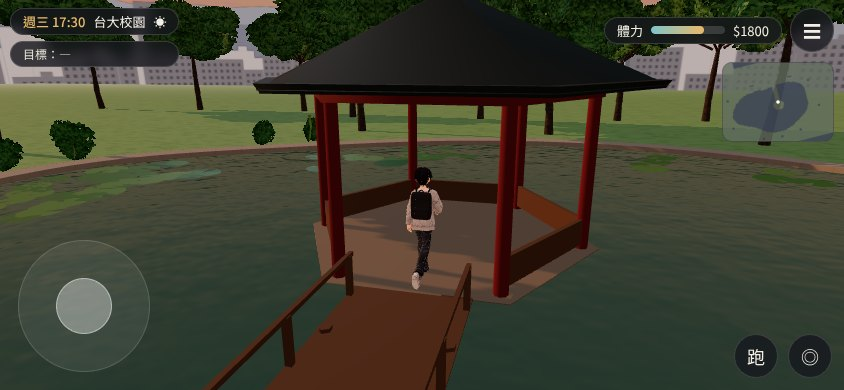

**刻意和真實不同的地方**（決策 D25）：
- 法律學院（霖澤館、萬才館）放在小椰林道北端，不在最東北的辛亥路口。
- 社會科學院在總圖北邊。
- 舟山路改成行政大樓後面的東西向直路。
- 醉月湖離大道比較近。
- 整體大約壓成 1:3.7。

原因有兩個：
- 霖澤館、宿舍、校門的位置都沒動，舊存檔和回歸測試的出生點不受影響。
- 手機上照真實比例走 700 m 太久。

**還不夠的地方**：
- 建築仍然是 LEVEL_BLOCKOUT 方盒：總圖、行政大樓、文學院只有立面窗格，沒有台大建築特有的洗石子、拱廊、屋瓦細節。（第六批已把行政大樓、文學院、校史館、總圖換掉，見下方。）
- 平面圖上幾十棟系館大多沒有蓋。
- 傅鐘的造型是簡化的小鐘亭。
- 醉月湖水面只反射天空顏色和一條樹影色帶，沒有真正的倒影。

狀態：配置與導航 **技術完成**；美術 `READY_FOR_ART_REVIEW`。

### v9.3 第六批：行政大樓、文學院、校史館、總圖換成台大風格的外觀

**參考**：使用者提供的平面圖只有配置，沒有建築外觀。外觀依台大老建築常見的共同特徵來做：
- 面磚或紅磚牆
- 半圓拱窗
- 一樓連續拱廊
- 淺色石材（洗石子感）的窗框、腰帶、簷口
- 四坡屋頂

做法是一套可以重複使用的程式化建築套件 `src/campuskit3d.js`（`CK.hall`），沒有外部素材。**不是照真實立面逐棟建模**：各棟的牆色、層數、門廊形式只做概略區分。

同一個鏡頭的修改前／後（左：v9.3 第五批 `edb01e8`，右：這一批；都是實際遊戲畫面，10:30）：

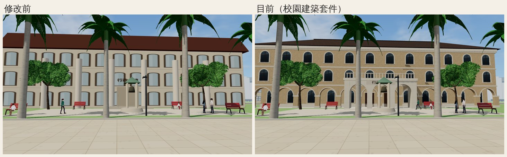

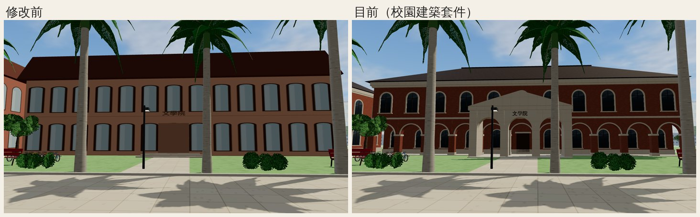

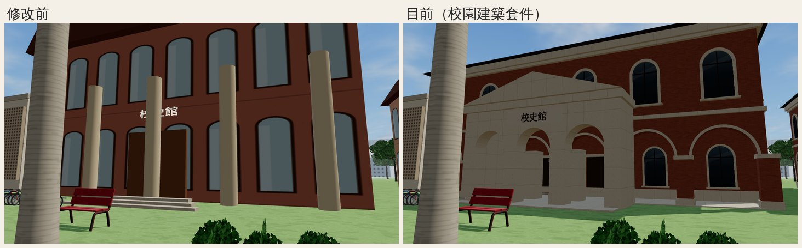

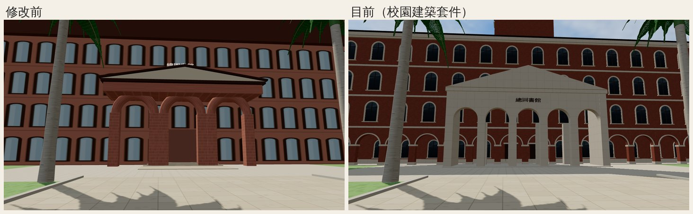

| | 修改前 | 現在 |
|---|---|---|
| 牆面 | 單色平面＋窗格貼圖 | 有磚縫與細直溝的面磚貼圖：行政大樓淺黃褐，其他三棟紅褐 |
| 窗 | 貼在牆上的方窗 | 立體的半圓拱窗：石材窗框、窗台、直櫺與橫櫺 |
| 一樓 | 平的牆 | 往內退的連續拱廊（柱墩、拱圈、石材收邊、天花板），廊內有門和窗 |
| 入口 | 行政大樓、校史館是幾根獨立的圓柱；總圖是紅磚三連拱 | 往前突出的石材門廊。文學院、校史館、總圖有三角山牆；行政大樓是陽台欄杆；總圖是五連拱的高門廊，後面有中央塔樓 |
| 屋頂 | 細長的斜面 | 四坡屋頂＋屋脊＋石材簷口 |

椰林大道往東走，盡頭是總圖（15:30，演出鏡頭）：

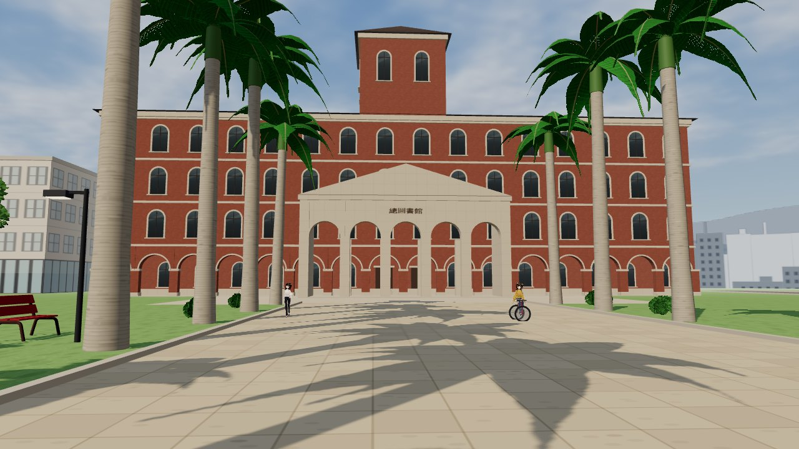

文學院 17:30（傍晚窗戶亮起來）、行政大樓 20:30（夜晚）：

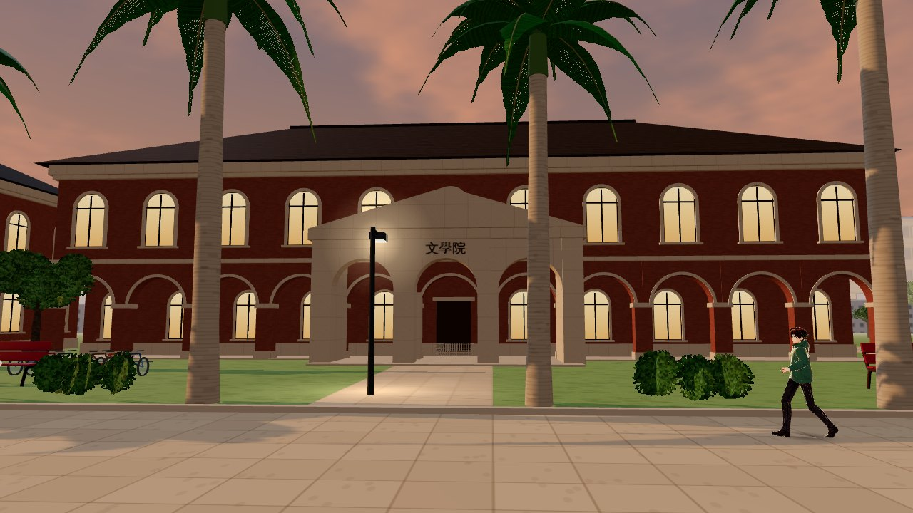

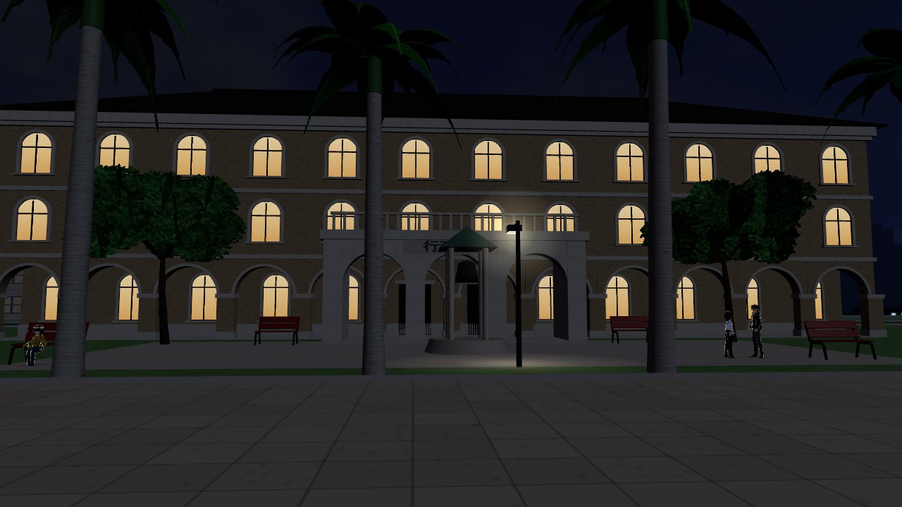

校史館門廊近景（10:30）：

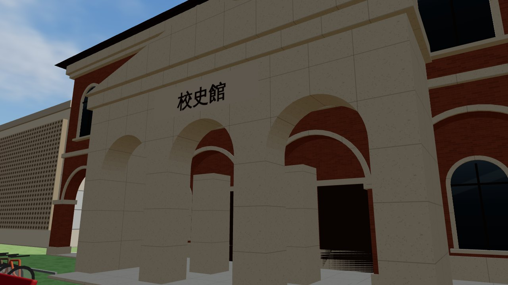

手機上的一般跟隨鏡頭（左：直向，傅鐘旁往行政大樓；右：橫向，椰林大道往總圖）：

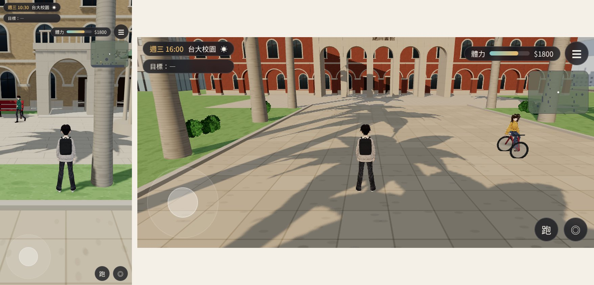

**導航與碰撞**：
- 建築本體和原本一樣整棟不能走，佔地尺寸沒變。
- 門廊兩側的牆、門廊中間的柱子有碰撞，門廊裡面可以走到門口。
- 行政大樓前、總圖門口照樣走得到（`campus_layout_nav` 29/29）。

**還不夠的地方**：
- 一樓拱廊看得到、但走不進去：導航格把整棟建築（含拱廊）擋住。要走進拱廊，導航格和鏡頭碰撞都要改，列為下一步。
- 行政大樓、校史館、總圖的門廊和後面拱廊的柱子沒有對齊（差半個開間）：從門廊看進去，拱的正中間有一根門廊後排的柱子（上面總圖的照片看得到）。下一批修。
- 屋頂只有瓦片貼圖，沒有立體的瓦和屋脊裝飾。
- 傍晚、晚上所有窗戶一起亮（同一個材質），看起來像每間教室都開燈；之後可以讓一部分窗戶暗著。
- 霖澤館、萬才館、社科院、農業陳列館、宿舍仍是方盒。

狀態：**技術完成**；美術 `READY_FOR_ART_REVIEW`（需要使用者看過是不是「像台大」）。

## 9. 日式老屋與小公園（v9.3）

規範（`ART_DIRECTION.md` 第 6 節）：
- 日式老屋要「從一般街道視角就看得到主要外觀（不能被圍牆整個擋住）」。
- 小公園要有樹蔭、長椅、有材質的地面、植物，玩家可以走動、坐下。

**日式老屋**：同一個巷子視角，左：v9.2，右：v9.3。

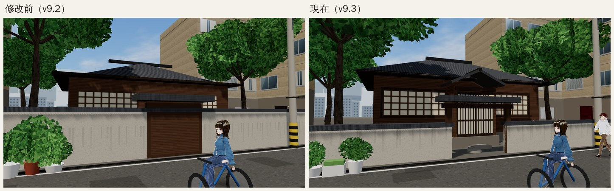

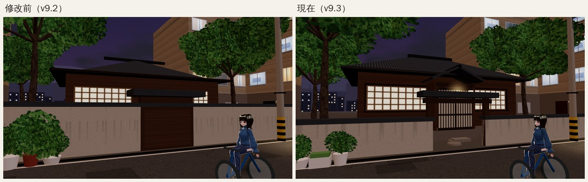

修改前，1.7 m 的圍牆從巷子看過去幾乎把整棟房子擋住，只看得到屋頂。

這次：
- 圍牆降到 1.15 m，門開著（冠木門），房子往前 0.5 m。
- 玄關往前突出：小三角屋頂、木格拉門、門燈（晚上亮）、門口踏石。
- 窗戶加深色木框與窗台。
- 院子：從門口到玄關的踏石、石燈籠（晚上微亮）、牆後矮籬。

**小公園**：同一個巷子視角，左：v9.2，右：v9.3。

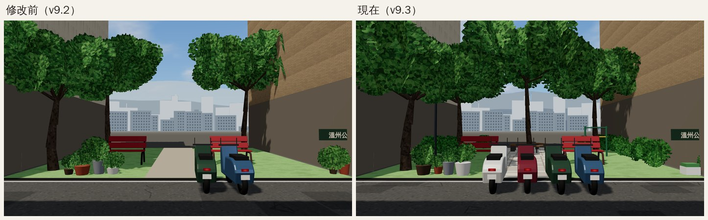

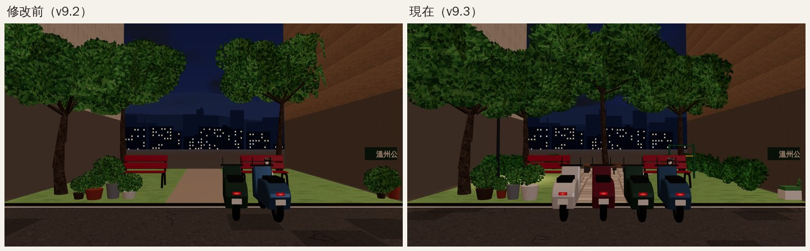

手機直向、一般跟隨鏡頭：

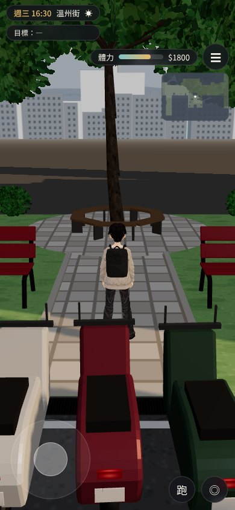

這次：
- 鋪面步道（有路緣），通到後方的圓形小廣場。
- 小廣場中間一棵大樹，樹下是可以坐的樹圍座椅（台北鄰里公園常見）。
- 兩側和後方有灌木，還有一座單槓。
- 公園路燈：晚上會照亮地面。
- 右邊長椅上睡著一隻橘貓（劇情的環境文字本來就寫「小公園的長椅上有隻貓在睡覺」，現在畫面上真的有）。

**還不夠的地方**：
- 日式老屋只有正面細節，側面和背面還是平的雨淋板。
- 屋頂已改成寄棟（四坡，有屋脊）；瓦片是貼圖，沒有真實的瓦片起伏。
- 貓是靜態的，不會動。

## 10. 三個時段的光影（同一位置）

參考圖 06 第四部分的標準：白天自然、乾淨、有陰影層次；黃昏暖光照亮部分建築立面；夜晚街燈和店家燈光自然、仍看得清楚人物；同一場景三個時段風格一致；不能只有燈泡光暈、周遭建築沒有光線影響；不要過曝或塑膠反光。

兩點半 Café 門口（同一個鏡頭：路口南側往北看，Café 在左，路往北延伸）：

| 11:00 | 17:30 | 20:30 |
|---|---|---|
| 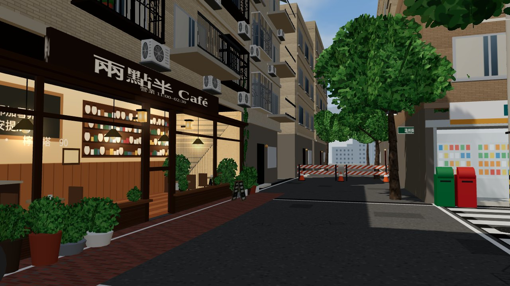 | 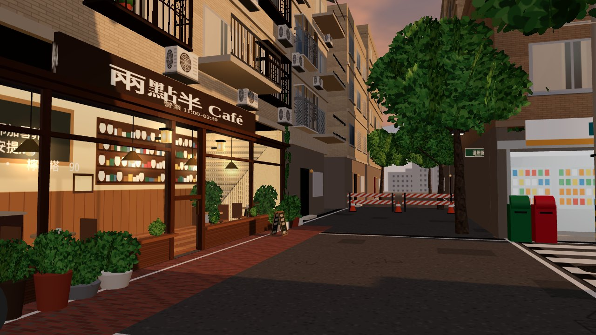 | 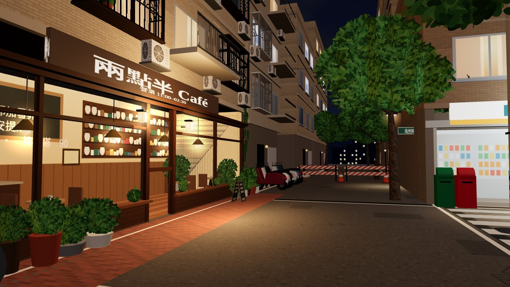 |

小公園（同一個鏡頭）：

| 11:00 | 17:30 | 19:30 |
|---|---|---|
| 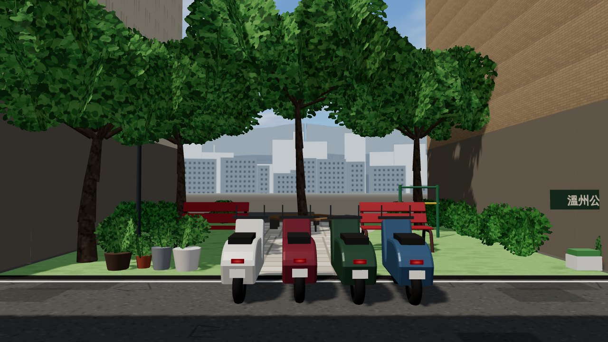 | 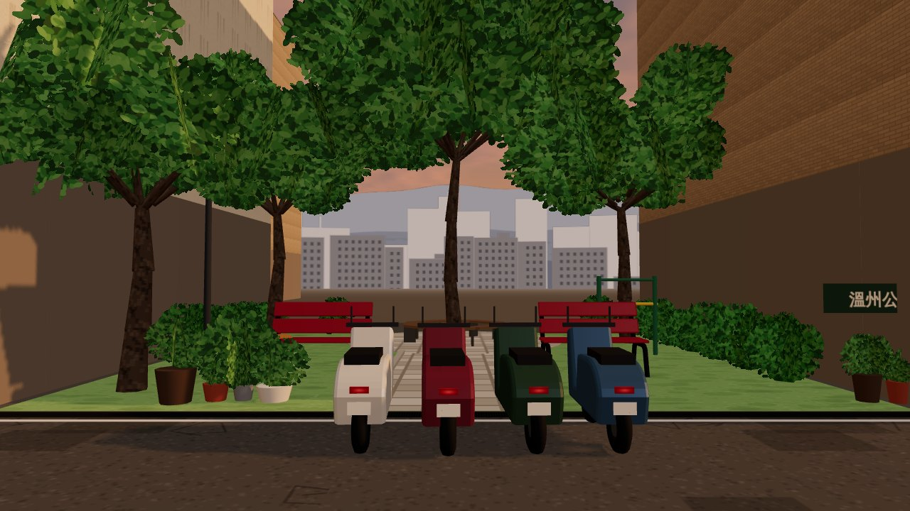 | 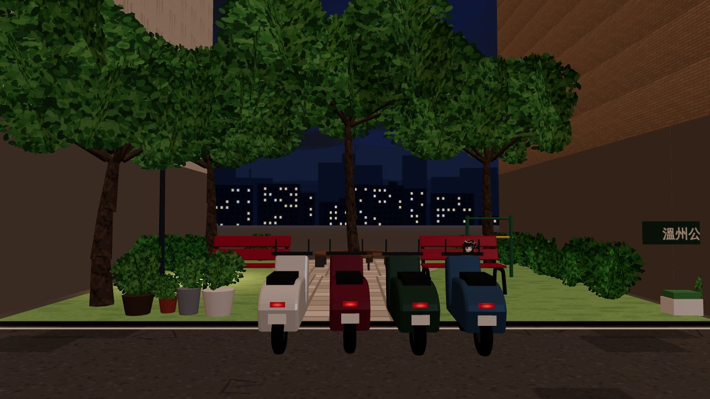 |

**黃昏**（同一個鏡頭，左：修改前，右：目前）。17:00–18:00 的陽光與天空略調亮、偏暖，雲的陰影不再偏紫。老實說差別很小：畫面平均亮度只多約 3%，這個位置的街道大部分在建築陰影裡：

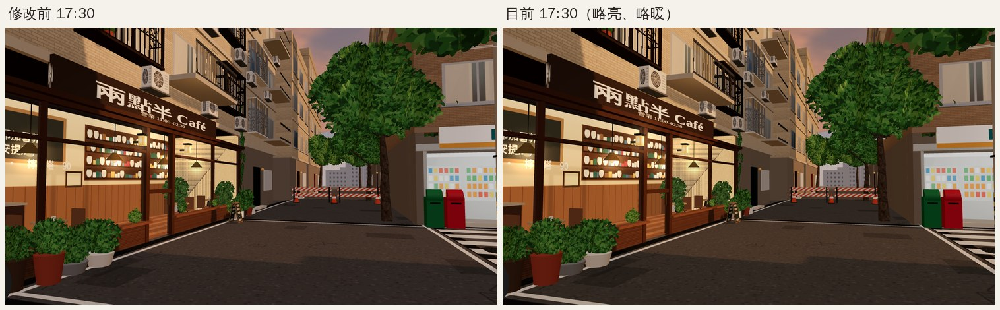

**夜晚**（同一個鏡頭，左：修改前，右：目前）。Café 櫥窗的暖光灑到騎樓和路面；路口往北的路多一盞路燈，照亮路面：

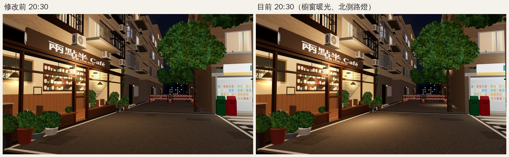

**還不夠的地方**：
- 黃昏還是比參考圖暗、不夠金：街道在建築陰影裡。人物已加上頭髮與上衣的暖色輪廓光（第 1 節）；整體暖色調改動比較大，會先拍給使用者看。
- 夜晚的光暈是貼地的半透明圓片（加法混色），不是真正的光照，所以不會照亮旁邊的牆和人物（溫州街只有 Café、便利商店、書店門口三個真正的點光源）。
- 公館、校園的傍晚還沒有用新的黃昏設定重新截圖。
